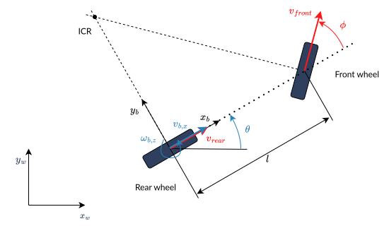

:github_url: https://github.com/ros-controls/ros2_controllers/blob/{REPOS_FILE_BRANCH}/doc/mobile_robot_kinematics.rst

.. _mobile_robot_kinematics:

Wheeled Mobile Robot Kinematics
--------------------------------------------------------------

.. _siciliano: https://link.springer.com/book/10.1007/978-1-84628-642-1
.. _modern_robotics: http://modernrobotics.org/

This page introduces the kinematics of different wheeled mobile robots. For further reference see `Siciliano et.al - Robotics: Modelling, Planning and Control <siciliano_>`_ and `Kevin M. Lynch and Frank C. Park - Modern Robotics: Mechanics, Planning, And Control <modern_robotics_>`_.

Wheeled mobile robots can be classified in two categories:

Omnidirectional robots
  which can move instantaneously in any direction in the plane, and

Nonholonomic robots
  which cannot move instantaneously in any direction in the plane.

The forward integration of the kinematic model using the encoders of the wheel actuators — is referred to as **odometric localization** or **passive localization** or **dead reckoning**. We will call it just **odometry**.

Omnidirectional Wheeled Mobile Robots
.....................................

Omnidirectional Drive Robots using Omni Wheels
,,,,,,,,,,,,,,,,,,,,,,,,,,,,,,,,,,,,,,,,,,,,,,

The below explains the kinematics of omnidirectional drive robots using 3 or more omni wheels.
It follows the coordinate conventions defined in `ROS REP 103 <https://www.ros.org/reps/rep-0103.html>`__.

.. image:: images/omni_wheel_omnidirectional_drive.svg
   :width: 550
   :align: center
   :alt: Omnidirectional Drive Robot using Omni Wheels

* :math:`x_b,y_b` is the robot's body-frame coordinate system, located at the contact point of the wheel on the ground.
* :math:`x_w,y_w` is the world coordinate system.
* :math:`v_{b,x},` is the robot's linear velocity on the x-axis.
* :math:`v_{b,y}` is the robot's linear velocity on the y-axis.
* :math:`\omega_{b,z}` is the robot's angular velocity on the z-axis.
* :math:`R` is the robot's radius / the distance between the robot's center and the wheels.
* Red arrows on the wheel :math:`i` signify the positive direction of their rotation :math:`\omega_i`
* :math:`\gamma` is the angular offset of the first wheel from :math:`x_b`.
* :math:`\theta` is the angle between each wheel which can be calculated using the below equation where :math:`n` is the number of wheels.

.. math::

   \theta = \frac{2\pi}{n}

**Inverse Kinematics**

The necessary angular velocity of the wheels to achieve a desired body twist can be calculated using the below matrix:

.. math::

  A =
  \begin{bmatrix}
    \sin(\gamma) & -\cos(\gamma) & -R  \\
    \sin(\theta + \gamma) & -\cos(\theta + \gamma) & -R\\
    \sin(2\theta + \gamma) & -\cos(2\theta + \gamma) & -R\\
    \sin(3\theta + \gamma) & -\cos(3\theta + \gamma) & -R\\
    \vdots & \vdots & \vdots\\
    \sin((n-1)\theta + \gamma) & -\cos((n-1)\theta + \gamma) & -R\\
  \end{bmatrix}

.. math::

  \begin{bmatrix}
    \omega_1\\
    \omega_2\\
    \omega_3\\
    \omega_4\\
    \vdots\\
    \omega_n
  \end{bmatrix} =
  \frac{1}{r}
  A
  \begin{bmatrix}
    v_{b,x}\\
    v_{b,y}\\
    \omega_{b,z}\\
  \end{bmatrix}

Here :math:`\omega_1,\ldots,\omega_n` are the angular velocities of the wheels and :math:`r` is the radius of the wheels.
These equations can be written in algebraic form for any wheel :math:`i` like this:

.. math::
  \omega_i = \frac{\sin((i-1)\theta + \gamma) v_{b,x} - \cos((i-1)\theta + \gamma) v_{b,y} - R \omega_{b,z}}{r}

**Forward Kinematics**

The body twist of the robot can be obtained from the wheel velocities by using the pseudoinverse of matrix :math:`A`.

.. math::

  \begin{bmatrix}
    v_{b,x}\\
    v_{b,y}\\
    \omega_{b,z}\\
  \end{bmatrix} =
  rA^\dagger
  \begin{bmatrix}
    \omega_1\\
    \omega_2\\
    \omega_3\\
    \omega_4\\
    \vdots\\
    \omega_n
  \end{bmatrix}

Swerve Drive Robots
,,,,,,,,,,,,,,,,,,,

The below explains the kinematics of omnidirectional drive robots using four swerve modules, each with independently controlled steering and driving motors. It follows the coordinate conventions defined in `REP-103 <https://www.ros.org/reps/rep-0103.html>`__.

.. image:: images/swerve_drive.svg
   :align: center
   :alt: Swerve Drive Robot

* :math:`x_b, y_b` is the robot's body-frame coordinate system, located at the geometric center of the robot.
* :math:`x_w, y_w` is the world coordinate system.
* :math:`v_{b,x}` is the robot's linear velocity on the x-axis.
* :math:`v_{b,y}` is the robot's linear velocity on the y-axis.
* :math:`\omega_{b,z}` is the robot's angular velocity on the z-axis.
* :math:`l` is the wheelbase (distance between front and rear wheels).
* :math:`w` is the track width (distance between left and right wheels).
* Red arrows on wheel :math:`i` signify the direction of the wheel's velocity :math:`v_i`.

Each swerve module :math:`i`, for :math:`i = 0, 1, 2, 3` (typically front-left, front-right, back-left, back-right) is located at :math:`(l_{i,x}, l_{i,y})` relative to the center, typically:

* Front-left: :math:`(l/2, w/2)`
* Front-right: :math:`(l/2, -w/2)`
* Back-left: :math:`(-l/2, w/2)`
* Back-right: :math:`(-l/2, -w/2)`

**Inverse Kinematics**

For each module :math:`i` at position :math:`(l_{i,x}, l_{i,y})`, the velocity vector is:

.. math::

   \begin{bmatrix}
   v_{i,x} \\
   v_{i,y}
   \end{bmatrix}
   =
   \begin{bmatrix}
   v_{b,x} - \omega_{b,z} l_{i,y} \\
   v_{b,y} + \omega_{b,z} l_{i,x}
   \end{bmatrix}

The wheel velocity :math:`v_i` and steering angle :math:`\phi_i` are:

.. math::

   v_i = \sqrt{v_{i,x}^2 + v_{i,y}^2}

.. math::

   \phi_i = \arctan2(v_{i,y}, v_{i,x})

**Odometry**

The body twist of the robot is computed from the wheel velocities :math:`v_i` and steering angles :math:`\phi_i`. Each module’s velocity components in the body frame are:

.. math::

  v_{i,x} = v_i \cos(\phi_i), \quad v_{i,y} = v_i \sin(\phi_i)

The chassis velocities are calculated as:

.. math::

  v_{b,x} = \frac{1}{4} \sum_{i=0}^{3} v_{i,x}, \quad v_{b,y} = \frac{1}{4} \sum_{i=0}^{3} v_{i,y}

.. math::

  \omega_{b,z} = \frac{\sum_{i=0}^{3} (v_{i,y} l_{i,x} - v_{i,x} l_{i,y})}{\sum_{i=0}^{3} (l_{i,x}^2 + l_{i,y}^2)}

Odometry updates the robot’s pose (:math:`x`, :math:`y`, :math:`\theta`) in the global frame using the computed chassis velocities. The global velocities are:

.. math::

   v_{x,\text{global}} = v_{b,x} \cos(\theta) - v_{b,y} \sin(\theta)

.. math::

   v_{y,\text{global}} = v_{b,x} \sin(\theta) + v_{b,y} \cos(\theta)

Nonholonomic Wheeled Mobile Robots
.....................................

Unicycle model
,,,,,,,,,,,,,,,,

To define the coordinate systems (`ROS coordinate frame conventions <https://www.ros.org/reps/rep-0103.html#id19>`__, the coordinate systems follow the right-hand rule), consider the following simple unicycle model

.. image:: images/unicycle.svg
   :width: 550
   :align: center
   :alt: Unicycle

* :math:`x_b,y_b` is the robot's body-frame coordinate system, located at the contact point of the wheel on the ground.
* :math:`x_w,y_w` is the world coordinate system.
* :math:`x,y` are the robot's Cartesian coordinates in the world coordinate system.
* :math:`\theta` is the robot's heading angle, i.e. the orientation of the robot's :math:`x_b`-axis w.r.t. the world's :math:`x_w`-axis.

In the following, we want to command the robot with a desired body twist

.. math::

  \vec{\nu}_b = \begin{bmatrix}
                  \vec{\omega}_{b} \\
                  \vec{v}_{b}
                \end{bmatrix},

where :math:`\vec{v}_{b}` is the linear velocity of the robot in its body-frame, and :math:`\vec\omega_{b}` is the angular velocity of the robot in its body-frame. As we consider steering robots on a flat surface, it is sufficient to give

* :math:`v_{b,x}`, i.e. the linear velocity of the robot in direction of the :math:`x_b` axis.
* :math:`\omega_{b,z}`, i.e. the angular velocity of the robot about the :math:`x_z` axis.

as desired system inputs. The forward kinematics of the unicycle can be calculated with

.. math::
  \dot{x} &= v_{b,x} \cos(\theta) \\
  \dot{y} &= v_{b,x} \sin(\theta) \\
  \dot{\theta} &= \omega_{b,z}

We will formulate the inverse kinematics to calculate the desired commands for the robot (wheel speed or steering) from the given body twist.

Differential Drive Robot
,,,,,,,,,,,,,,,,,,,,,,,,

Citing `Siciliano et.al - Robotics: Modelling, Planning and Control <siciliano_>`_:

.. code-block:: text

  A unicycle in the strict sense (i.e., a vehicle equipped with a single wheel)
  is a robot with a serious problem of balance in static conditions. However,
  there exist vehicles that are kinematically equivalent to a unicycle but more
  stable from a mechanical viewpoint.

One of these vehicles is the differential drive robot, which has two wheels, each of which is driven independently.

.. image:: images/diff_drive.svg
   :width: 550
   :align: center
   :alt: Differential drive robot

* :math:`w` is the wheel track (the distance between the wheels).

**Forward Kinematics**

The forward kinematics of the differential drive model can be calculated from the unicycle model above using

.. math::
  v_{b,x} &= \frac{v_{right} + v_{left}}{2} \\
  \omega_{b,z} &= \frac{v_{right} - v_{left}}{w}

**Inverse Kinematics**

The necessary wheel speeds to achieve a desired body twist can be calculated with:

.. math::

  v_{left} &= v_{b,x} - \omega_{b,z} w / 2 \\
  v_{right} &= v_{b,x} + \omega_{b,z} w / 2

**Odometry**

We can use the forward kinematics equations above to calculate the robot's odometry directly from the encoder readings.

Car-Like (Bicycle) Model
,,,,,,,,,,,,,,,,,,,,,,,,

The following picture shows a car-like robot with two wheels, where the front wheel is steerable. This model is also known as the bicycle model.

* :math:`\phi` is the steering angle of the front wheel, counted positive in direction of rotation around :math:`x_z`-axis.
* :math:`v_{rear}, v_{front}` is the velocity of the rear and front wheel.
* :math:`l` is the wheelbase.

We assume that the wheels are rolling without slipping. This means that the velocity of the contact point of the wheel with the ground is zero and the wheel's velocity points in the direction perpendicular to the wheel's axis. The **Instantaneous Center of Rotation** (ICR), i.e. the center of the circle around which the robot rotates, is located at the intersection of the lines that are perpendicular to the wheels' axes and pass through the contact points of the wheels with the ground.

As a consequence of the no-slip condition, the velocity of the two wheels must satisfy the following constraint:

.. math::
  v_{rear} = v_{front} \cos(\phi)

**Forward Kinematics**

The forward kinematics of the car-like model can be calculated with

.. math::
  \dot{x} &= v_{b,x} \cos(\theta) \\
  \dot{y} &= v_{b,x} \sin(\theta) \\
  \dot{\theta} &= \frac{v_{b,x}}{l} \tan(\phi)

**Inverse Kinematics**

The steering angle is one command input of the robot:

.. math::
  \phi = \arctan\left(\frac{l w_{b,z}}{v_{b,x}} \right)

For the rear-wheel drive, the velocity of the rear wheel is the second input of the robot:

.. math::
  v_{rear} = v_{b,x}

For the front-wheel drive, the velocity of the front wheel is the second input of the robot:

.. math::
  v_{front} = \frac{v_{b,x}}{\cos(\phi)}

**Odometry**

We have to distinguish between two cases: Encoders on the rear wheel or on the front wheel.

For the rear wheel case:

.. math::
  \dot{x} &= v_{rear} \cos(\theta) \\
  \dot{y} &= v_{rear} \sin(\theta) \\
  \dot{\theta} &= \frac{v_{rear}}{l} \tan(\phi)

For the front wheel case:

.. math::
  \dot{x} &= v_{front} \cos(\theta) \cos(\phi)\\
  \dot{y} &= v_{front} \sin(\theta) \cos(\phi)\\
  \dot{\theta} &= \frac{v_{front}}{l} \sin(\phi)

Double-Traction Axle
,,,,,,,,,,,,,,,,,,,,,

The following image shows a car-like robot with three wheels, with two independent traction wheels at the rear.

.. image:: images/double_traction.svg
   :width: 550
   :align: center
   :alt: A car-like robot with two traction wheels at the rear

* :math:`w_r` is the wheel track of the rear axle.

**Forward Kinematics**

The forward kinematics is the same as the car-like model above.

**Inverse Kinematics**

The turning radius of the robot is

.. math::
  R_b = \frac{l}{\tan(\phi)}

Then the velocity of the rear wheels must satisfy these conditions to avoid skidding

.. math::
  v_{rear,left} &= v_{b,x}\frac{R_b - w_r/2}{R_b}\\
  v_{rear,right} &= v_{b,x}\frac{R_b + w_r/2}{R_b}

**Odometry**

The calculation of :math:`v_{b,x}` from two encoder measurements of the traction axle is overdetermined.
If there is no slip and the encoders are ideal,

.. math::
   v_{b,x} = v_{rear,left} \frac{R_b}{R_b - w_r/2} =  v_{rear,right} \frac{R_b}{R_b + w_r/2}

holds. But to get a more robust solution, we take the average of both , i.e.,

.. math::
   v_{b,x} = 0.5 \left(v_{rear,left} \frac{R_b}{R_b - w_r/2} + v_{rear,right} \frac{R_b}{R_b + w_r/2}\right).

Ackermann Steering
,,,,,,,,,,,,,,,,,,,,,

The following image shows a four-wheeled robot with two independent steering wheels in the front.

.. image:: images/ackermann_steering.svg
   :width: 550
   :align: center
   :alt: A car-like robot with two steering wheels at the front

* :math:`w_f` is the wheel track of the front axle, measured between the two kingpins.

To prevent the front wheels from slipping, the steering angle of the front wheels cannot be equal.
This is the so-called **Ackermann steering**.

.. note::
  Ackermann steering can also be achieved by a `mechanical linkage between the two front wheels <https://en.wikipedia.org/wiki/Ackermann_steering_geometry>`__.  In this case the robot has only one steering input, and the steering angle of the two front wheels is mechanically coupled. The inverse kinematics of the robot will then be the same as in the car-like model above.

**Forward Kinematics**

The forward kinematics is the same as for the car-like model above.

**Inverse Kinematics**

The turning radius of the robot is

.. math::
  R_b = \frac{l}{\tan(\phi)}

Then the steering angles of the front wheels must satisfy these conditions to avoid skidding

.. math::
  \phi_{left} &= \arctan\left(\frac{l}{R_b - w_f/2}\right) = \arctan\left(\frac{2l\sin(\phi)}{2l\cos(\phi) - w_f\sin(\phi)}\right)\\
  \phi_{right} &= \arctan\left(\frac{l}{R_b + w_f/2}\right) = \arctan\left(\frac{2l\sin(\phi)}{2l\cos(\phi) + w_f\sin(\phi)}\right)

**Odometry**

The calculation of :math:`\phi` from two angle measurements of the steering axle is overdetermined.
If there is no slip and the measurements are ideal,

.. math::
    \phi = \arctan\left(\frac{l\tan(\phi_{left})}{l + w_f/2 \tan(\phi_{left})}\right) = \arctan\left(\frac{l\tan(\phi_{right})}{l - w_f/2 \tan(\phi_{right})}\right)

holds. But to get a more robust solution, we take the average of both , i.e.,

.. math::
    \phi = 0.5 \left(\arctan\left(\frac{l\tan(\phi_{left})}{l + w_f/2 \tan(\phi_{left})}\right) + \arctan\left(\frac{l\tan(\phi_{right})}{l - w_f/2 \tan(\phi_{right})}\right)\right).

Ackermann Steering with Traction
,,,,,,,,,,,,,,,,,,,,,,,,,,,,,,,,,

The following image shows a four-wheeled car-like robot with two independent steering wheels at the front, which are also driven independently.

.. image:: images/ackermann_steering_traction.svg
   :width: 550
   :align: center
   :alt: A car-like robot with two steering wheels at the front, which are also independently driven.

* :math:`d_{kp}` is the distance from the kingpin to the contact point of the front wheel with the ground.

**Forward Kinematics**

The forward kinematics is the same as the car-like model above.

**Inverse Kinematics**

To avoid slipping of the front wheels, the velocity of the front wheels cannot be equal and

.. math::
  \frac{v_{front,left}}{R_{left}} = \frac{v_{front,right}}{R_{right}} = \frac{v_{b,x}}{R_b}

with turning radius of the robot and the left/right front wheel

.. math::
  R_b       &= \frac{l}{\tan(\phi)} \\
  R_{left}  &= \frac{l-d_{kp}\sin(\phi_{left})}{\sin(\phi_{left})}\\
  R_{right} &= \frac{l+d_{kp}\sin(\phi_{right})}{\sin(\phi_{right})}.

This results in the following inverse kinematics equations

.. math::
  v_{front,left} &= \frac{v_{b,x}(l-d_{kp}\sin(\phi_{left}))}{R_b\sin(\phi_{left})}\\
  v_{front,right} &= \frac{v_{b,x}(l+d_{kp}\sin(\phi_{right}))}{R_b\sin(\phi_{right})}

with the steering angles of the front wheels from the Ackermann steering equations above.

**Odometry**

The calculation of :math:`v_{b,x}` from two encoder measurements of the traction axle is again overdetermined.
If there is no slip and the encoders are ideal,

.. math::
   v_{b,x} = v_{front,left} \frac{R_b\sin(\phi_{left})}{l-d_{kp}\sin(\phi_{left})} =  v_{front,right} \frac{R_b\sin(\phi_{right})}{l+d_{kp}\sin(\phi_{right})}

holds. But to get a more robust solution, we take the average of both , i.e.,

.. math::
   v_{b,x} = 0.5 \left( v_{front,left} \frac{R_b\sin(\phi_{left})}{l-d_{kp}\sin(\phi_{left})} +  v_{front,right} \frac{R_b\sin(\phi_{right})}{l+d_{kp}\sin(\phi_{right})}\right).
