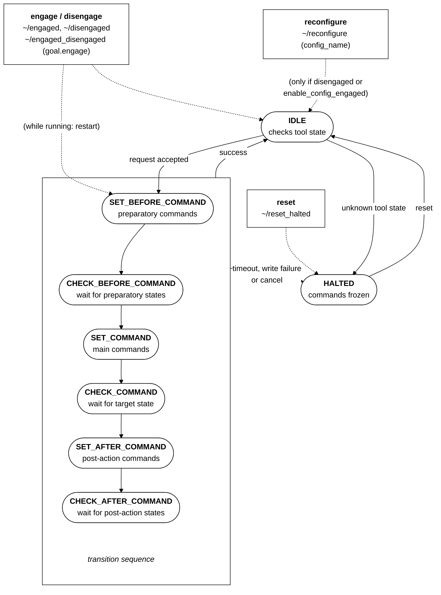

State machine of the `gpio_tool_controller`.
Ovals are states, rectangles are requests (services and actions with default names).

```mermaid
%%{init: {"theme": "base", "themeVariables": {"background": "#ffffff", "primaryColor": "#ffffff", "primaryTextColor": "#000000", "primaryBorderColor": "#000000", "lineColor": "#000000", "clusterBkg": "#ffffff", "clusterBorder": "#000000", "edgeLabelBackground": "#ffffff"}}}%%
flowchart TD
    ENG["<b>engage / disengage</b><br/>~/engaged, ~/disengaged<br/>~/engaged_disengaged (goal.engage)"]
    REC["<b>reconfigure</b><br/>~/reconfigure (config_name)"]
    RST["<b>reset</b><br/>~/reset_halted"]

    IDLE(["<b>IDLE</b><br/>checks tool state"])
    HALTED(["<b>HALTED</b><br/>commands frozen"])

    subgraph SEQ [" "]
        SBC(["<b>SET_BEFORE_COMMAND</b><br/>preparatory commands"])
        CBC(["<b>CHECK_BEFORE_COMMAND</b><br/>wait for preparatory states"])
        SC(["<b>SET_COMMAND</b><br/>main commands"])
        CC(["<b>CHECK_COMMAND</b><br/>wait for target state"])
        SAC(["<b>SET_AFTER_COMMAND</b><br/>post-action commands"])
        CAC(["<b>CHECK_AFTER_COMMAND</b><br/>wait for post-action states"])
        SEQ_TITLE["<i>transition sequence</i>"]
        SBC --> CBC --> SC --> CC --> SAC --> CAC ~~~ SEQ_TITLE
    end
    style SEQ_TITLE fill:none,stroke:none

    ENG -.-> IDLE
    ENG -.->|"(while running: restart)"| SBC
    REC -.->|"(only if disengaged or<br/>enable_config_engaged)"| IDLE
    RST -.-> HALTED

    IDLE -->|request accepted| SBC
    SEQ -->|success| IDLE
    SEQ -->|"timeout, write failure<br/>or cancel"| HALTED
    IDLE -->|unknown tool state| HALTED
    HALTED -->|reset| IDLE
```
