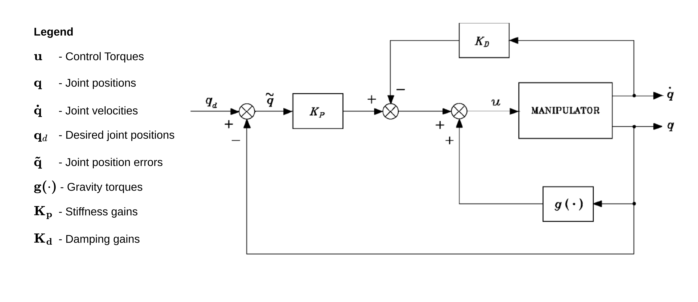

# gravity_compensation_pd_controller

This package provides a PD controller with gravity compensation that converts joint position references to joint effort commands for a robotic manipulator.
It is a chainable controller; therefore, it requires another controller to provide joint position references via chaining.

## Control Law

The implemented control law follows the scheme shown in the figure, based on the formulation presented in _B. Siciliano, L. Sciavicco, L. Villani, G. Oriolo, "Robotics: Modelling, Planning and Control"_.

## Controller Configuration

The controller uses the robot's dynamic model to compute the control action.
In particular, it relies on the [InverseDynamicsSolver](https://index.ros.org/p/inverse_dynamics_solver/) interface to estimate the gravity torque vector.
Control parameters for the PD controller with gravity compensation are defined in the file [gravity_compensation_pd_controller_parameters.yaml](./src/gravity_compensation_pd_controller_parameters.yaml).
Please refer to [`gravity_compensation_pd_controller_parameters.md`](./doc/gravity_compensation_pd_controller_parameters.md) for the documentation.

## Behavior in Edge Cases

The controller is designed to handle the following edge cases:

- **Computed torque exceeding joint limits**. If the computed torque exceeds the joint limits, the controller will saturate the output to remain within the range specified in the robot description.

- **Invalid joint position reference**. If the joint position reference is `NaN`, the controller will fall back to the last valid reference to compute the control action. Initially, the first valid reference is set to the robot's starting joint positions.

- **Invalid joint position state**. If the controller detects a `NaN` value in the joint position state reported by the robot, it will return an error to the controller manager. In this case, the controller cannot compute a valid control action and will output `NaN` values. It is assumed that the hardware interface is capable of handling `NaN` values appropriately.
