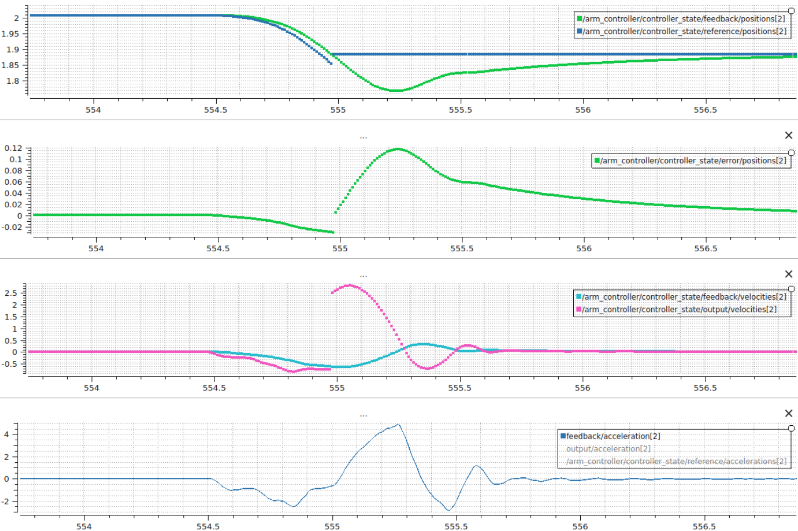
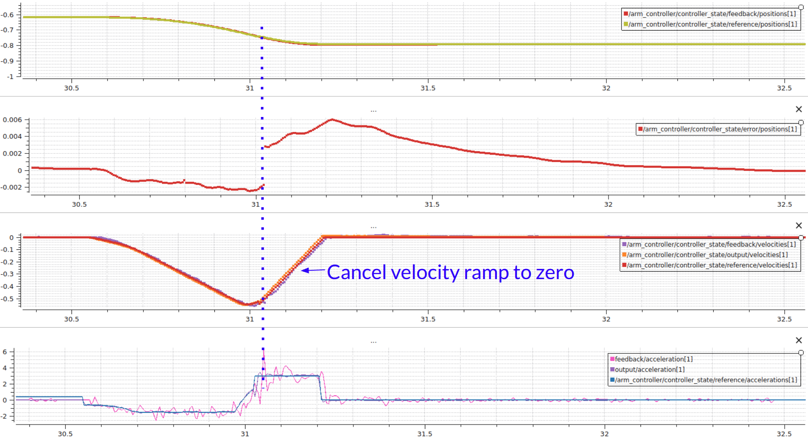

:github_url: https://github.com/ros-controls/ros2_controllers/blob/{REPOS_FILE_BRANCH}/joint_trajectory_controller/doc/decelerate_on_cancel.rst

.. _joint_trajectory_controller_decelerate_on_cancel:

Decelerate on cancel
====================

By default, when a trajectory is canceled or preempted, the controller immediately holds the current position.
This can cause problems for hardware that is moving at high velocity, as the abrupt stop may trigger faults or cause excessive wear.

When the ``decelerate_on_cancel`` feature is enabled, the controller instead generates a smooth stop trajectory that decelerates each joint to zero velocity using a constant deceleration profile before holding position.

*Default behavior: the controller instantly sets the command position to the current position when a trajectory is canceled, causing an abrupt stop.*

*With decelerate on cancel enabled: the controller generates a ramped stop trajectory that smoothly decelerates each joint before holding position.*

How it works
------------

When a trajectory is canceled or preempted and ``decelerate_on_cancel`` is enabled, the controller:

1. Reads the current velocity of each joint from the velocity state interface.
2. Computes the stopping distance and time for each joint using its configured ``max_deceleration_on_cancel`` value:

   .. math::

      t_{stop} = \frac{|v|}{a_{max}}

   .. math::

      d_{stop} = \frac{v \cdot t_{stop}}{2}

   where :math:`v` is the current velocity and :math:`a_{max}` is the configured maximum deceleration.

3. Generates a trajectory with intermediate waypoints that linearly ramp velocity to zero over the computed stopping time.
4. Appends a final hold-position point at the computed stop position.

Each joint decelerates independently based on its own ``max_deceleration_on_cancel`` value, but the trajectory is synchronized so all joints finish at the same time (the slowest joint's stop time).

Requirements
------------

* The hardware must provide a ``velocity`` state interface for all joints in the controller. If velocity state feedback is not available, the controller falls back to the default hold-position behavior.
* Each joint must have a valid (greater than zero) ``max_deceleration_on_cancel`` value. Joints with a value of ``0.0`` cause the controller to fall back to hold-position behavior.

Configuration
-------------

Enable the feature by setting ``constraints.decelerate_on_cancel`` to ``true`` and providing a ``max_deceleration_on_cancel`` value (in rad/s^2 or m/s^2) for each joint under ``constraints.<joint_name>``:

.. code-block:: yaml

   controller_name:
     ros__parameters:
       joints:
         - joint_1
         - joint_2
         - joint_3

       constraints:
         decelerate_on_cancel: true
         stopped_velocity_tolerance: 0.01
         goal_time: 0.0
         joint_1:
           max_deceleration_on_cancel: 10.0
         joint_2:
           max_deceleration_on_cancel: 3.0
         joint_3:
           max_deceleration_on_cancel: 6.0

.. note::

   Both ``decelerate_on_cancel`` and ``max_deceleration_on_cancel`` are read-only parameters. They can only be set at controller configuration time and cannot be changed at runtime.

.. note::

   Choose ``max_deceleration_on_cancel`` values that are within the physical limits of your hardware. Values that are too high may still cause faults, while values that are too low will result in longer stopping distances.
