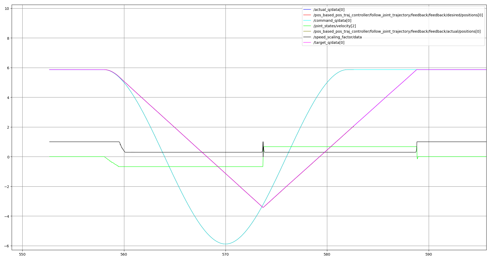
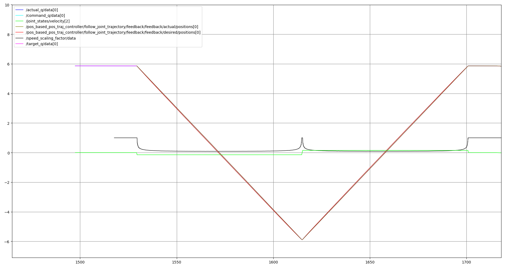

.. _jtc_speed_scaling:

Speed scaling
=============

The ``joint_trajectory_controller`` (JTC) supports dynamically scaling its trajectory execution speed.
That means, when specifying a scaling factor :math:`{f}` of less than 1, execution will proceed only
:math:`{f \cdot \Delta_t}` per control step where :math:`{\Delta_t}` is the controller's cycle time.

Methods of speed scaling
------------------------

Generally, the speed scaling feature has two separate scaling approaches in mind: On-Robot scaling
and On-Controller scaling. They are both conceptually different and to correctly configure speed
scaling it is important to understand the differences.

On-Robot speed scaling
~~~~~~~~~~~~~~~~~~~~~~

This scaling method is intended for robots that provide a scaling feature directly on the robot's
teach pendant and / or through a safety feature. One example of such robots are the `Universal
Robots manipulators <https://github.com/UniversalRobots/Universal_Robots_ROS2_Driver>`_.

The hardware interface needs to report the speed scaling through a state interface so it can be
read by the controller. Optionally, a command interface for setting the speed scaling value on the
hardware can be provided (if applicable) in order to set speed scaling through a ROS topic.

For the scope of this documentation a user-defined scaling and a safety-limited scaling will be
treated the same resulting in a "hardware scaling factor".

In this setup, the hardware will treat the command sent from the ROS controller (e.g. Reach joint
configuration :math:`{\theta}` within :math:`{\Delta_t}` seconds.). This effectively means that the
robot will only make half of the way towards the target configuration when a scaling factor of 0.5
is given (neglecting acceleration and deceleration influences during this time period).

The following plot shows trajectory execution (for one joint) with a hardware-scaled execution and
a controller that is **not** aware of speed scaling:

The graph shows a trajectory with one joint being moved to a target point and back to its starting
point. As the joint's speed is limited to a very low setting on the teach pendant, speed scaling
(black line) activates and limits the joint speed (green line). As a result, the target trajectory
(light blue) doesn't get executed by the robot, but instead the pink trajectory is executed. The
vertical distance between the light blue line and the pink line is the path error in each control
cycle. We can see that the path deviation gets above 300 degrees at some point and the target point
at -6 radians never gets reached.

With the scaled version of the trajectory controller the example motion shown in the previous diagram becomes:

The deviation between trajectory interpolation on the ROS side and actual robot execution stays
minimal and the robot reaches the intermediate setpoint instead of returning "too early" as in the
example above.

Scaling is done in such a way, that the time in the trajectory is virtually scaled. For example, if
a controller runs with a cycle time of 100 Hz, each control cycle is 10 ms long. A speed scaling of
0.5 means that in each time step the trajectory is moved forward by 5 ms instead.
So, the beginning of the 3rd timestep is 15 ms instead of 30 ms in the trajectory.

Command sampling is performed as in the unscaled case, with the timestep's start plus the **full**
cycle time of 10 ms. The robot will scale down the motion command by 50% resulting in only half of
the distance being executed, which is why the next control cycle will be started at the current
start plus half of the step time.

On-Controller speed scaling
~~~~~~~~~~~~~~~~~~~~~~~~~~~

Conceptually, with this scaling the robot hardware isn't aware of any scaling happening. The JTC
generates commands to be sent to the robot that are already scaled down accordingly, so they can be
directly executed by the robot.

Since the hardware isn't aware of speed scaling, the speed-scaling related command and state
interfaces should not be specified and the scaling factor will be set through the
``~/speed_scaling_input`` topic directly:

.. code:: console

   $ ros2 topic pub --qos-durability transient_local --once \
     /joint_trajectory_controller/speed_scaling_input control_msgs/msg/SpeedScalingFactor "{factor: 0.5}"

.. note::
   The ``~/speed_scaling_input`` topic uses the QoS durability profile ``transient_local``. This
   means you can restart the controller while still having a publisher on that topic active.

.. note::
   The current implementation only works for position-based interfaces.

Effect on tolerances
--------------------

When speed scaling is used while executing a trajectory, the tolerances configured for execution
will be scaled, as well.

Since commands are generated from the scaled trajectory time, **path errors** will also be compared
to the scaled trajectory.

The **goal time tolerance** also uses the virtual trajectory time. This means that a trajectory
being executed with a constant scaling factor of 0.5 will take twice as long for execution than the
``time_from_start`` value of the last trajectory point specifies. As long as the robot doesn't take
longer than that the goal time tolerance is considered to be met.

If an application relies on the actual execution time as set in the ``time_from_start`` fields, an
external monitoring has to be wrapped around the trajectory execution action.
