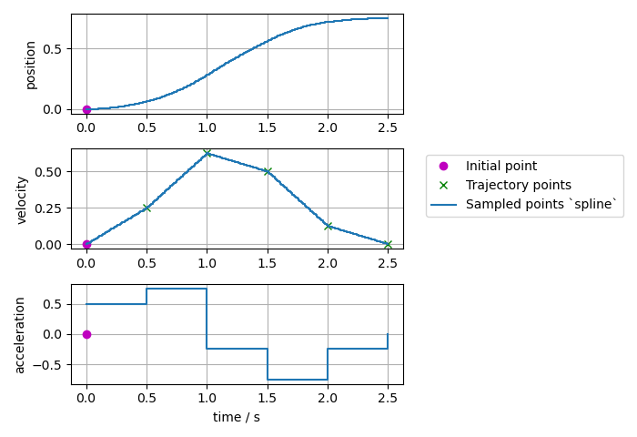
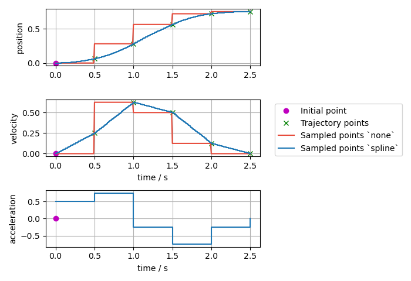
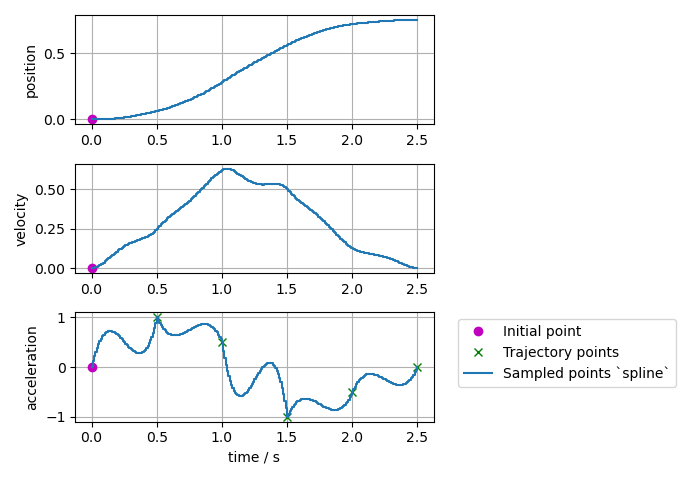
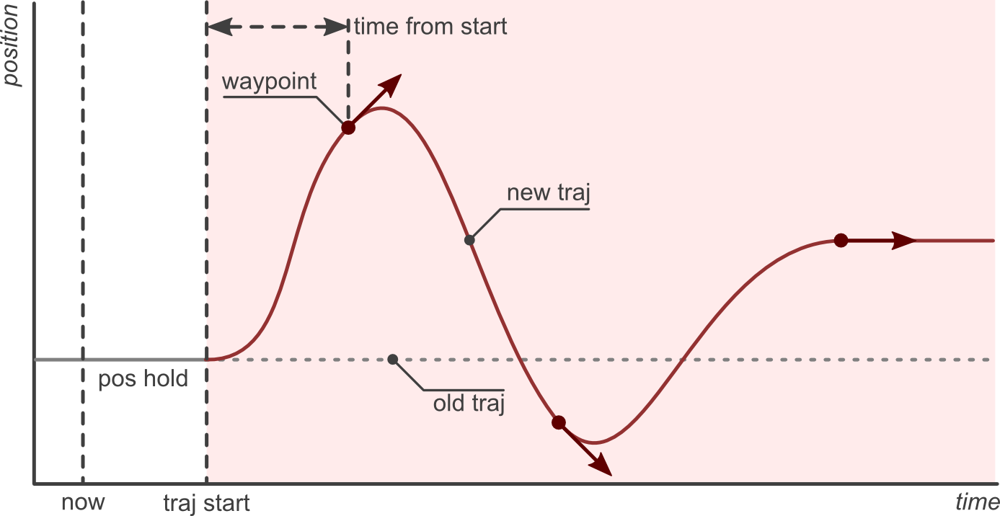

:github_url: https://github.com/ros-controls/ros2_controllers/blob/{REPOS_FILE_BRANCH}/joint_trajectory_controller/doc/trajectory.rst

.. _joint_trajectory_controller_trajectory_representation:

Trajectory Representation
---------------------------------

Trajectories are represented internally with ``trajectory_msgs/msg/JointTrajectory`` data structure.

Currently, two interpolation methods are implemented: ``none`` and ``spline``.
By default, a spline interpolator is provided, but it's possible to support other representations.

.. warning::
  The user has to ensure that the correct inputs are provided for the trajectory, which are needed
  by the controller's setup of command interfaces and PID configuration. There is no sanity check and
  missing fields in the sampled trajectory might cause segmentation faults.

Interpolation Method ``none``
^^^^^^^^^^^^^^^^^^^^^^^^^^^^^^
It returns the initial point until the time for the first trajectory data point is reached. Then, it simply takes the next given datapoint.

.. warning::
  It does not deduce (integrate) trajectory from derivatives, nor does it calculate derivatives.
  I.e., one has to provide position and its derivatives as needed.

Interpolation Method ``spline``
^^^^^^^^^^^^^^^^^^^^^^^^^^^^^^^^^^^

The spline interpolator uses the following interpolation strategies depending on the waypoint specification:

* Linear:

  * Used, if only position is specified.
  * Returns position and velocity
  * Guarantees continuity at the position level.
  * Discouraged because it yields trajectories with discontinuous velocities at the waypoints.

* Cubic:

  * Used, if position and velocity are specified.
  * Returns position, velocity, and acceleration.
  * Guarantees continuity at the velocity level.

* Quintic:

  * Used, if position, velocity and acceleration are specified
  * Returns position, velocity, and acceleration.
  * Guarantees continuity at the acceleration level.

Trajectories with velocity fields only, velocity and acceleration only, or acceleration fields only can be processed and are accepted, if ``allow_integration_in_goal_trajectories`` is true. Position (and velocity) is then integrated from velocity (or acceleration, respectively) by Heun's method.

Effort trajectories are allowed for controllers that claim the ``effort`` command interface and they are treated as feed-forward effort that is added to the position feedback. Effort is handled separately from position, velocity and acceleration. We use linear interpolation for effort when the ``spline`` interpolation method is selected.

Visualized Examples
^^^^^^^^^^^^^^^^^^^^^^^^^^^^^^^^
To visualize the difference of the different interpolation methods and their inputs, different trajectories defined at a 0.5s grid and are sampled at a rate of 10ms.

* Sampled trajectory with linear spline if position is given only:

.. image:: spline_position.png
  :alt: Sampled trajectory with splines if position is given only

* Sampled trajectory with cubic splines if velocity is given only (no deduction for interpolation method ``none``):

* Sampled trajectory if position and velocity is given:

.. note::
  If the same integration method was used (``Trajectory`` class uses Heun's method), then the ``spline`` method this gives identical results as above where velocity only was given as input.

* Sampled trajectory with quintic splines if acceleration is given only (no deduction for interpolation method ``none``):

* Sampled trajectory if position, velocity, and acceleration points are given:

.. note::
  If the same integration method was used (``Trajectory`` class uses Heun's method), then the ``spline`` method this gives identical results as above where acceleration only was given as input.

.. image:: spline_position_velocity_acceleration.png
  :alt: Sampled trajectory with splines if position, velocity, and acceleration is given

* Sampled trajectory if the same position, velocity, and acceleration points as above are given, but with a nonzero initial point:

.. image:: spline_position_velocity_acceleration_initialpoint.png
  :alt: Sampled trajectory with splines if position, velocity, and acceleration is given with nonzero initial point

* Sampled trajectory if the same position, velocity, and acceleration points as above are given but with the first point starting at ``t=0``:

.. note::
  If the first point is starting at ``t=0``, there is no interpolation from the initial point to the trajectory.

.. image:: spline_position_velocity_acceleration_initialpoint_notime.png
  :alt: Sampled trajectory with splines if position, velocity, and acceleration is given with nonzero initial point and first point starting at ``t=0``

* Sampled trajectory with splines if inconsistent position, velocity, and acceleration points are given:

.. note::
  Interpolation method ``none`` only gives the next input points, while the ``spline`` interpolation method shows high overshoot to match the given trajectory points.

.. image:: spline_wrong_points.png
  :alt: Sampled trajectory with splines if inconsistent position, velocity, and acceleration is given

.. _joint_trajectory_controller_trajectory_replacement:

Trajectory Replacement
---------------------------------
*Parts of this documentation were originally published in the ROS 1 wiki under the* `CC BY 3.0 license <https://creativecommons.org/licenses/by/3.0/>`_. [#f1]_

Joint trajectory messages allow to specify the time at which a new trajectory should start executing by means of the header timestamp, where zero time (the default) means "start now".

.. warning::

  As of now, this functionality is not ported to ROS 2, see `this issue <https://github.com/ros-controls/ros2_controllers/issues/84#issuecomment-2940787997>`__ for more information.
  The current implementation just forgets the old trajectory.

The arrival of a new trajectory command does not necessarily mean that the controller will completely discard the currently running trajectory and substitute it with the new one.
Rather, the controller will take the useful parts of both and combine them appropriately, yielding a smarter trajectory replacement strategy.

The steps followed by the controller for trajectory replacement are as follows:

  + Get useful parts of the new trajectory: Preserve all waypoints whose time to be reached is in the future, and discard those with times in the past.
    If there are no useful parts (ie. all waypoints are in the past) the new trajectory is rejected and the current one continues execution without changes.

  + Get useful parts of the current trajectory: Preserve the current trajectory up to the start time of the new trajectory, discard the later parts.

  + Combine the useful parts of the current and new trajectories.

The following examples describe this behavior in detail.

The first example shows a joint which is in hold position mode (flat grey line labeled *pos hold* in the figure below).
A new trajectory (shown in red) arrives at the current time (now), which contains three waypoints and a start time in the future (*traj start*).
The time at which waypoints should be reached (``time_from_start`` member of ``trajectory_msgs/JointTrajectoryPoint``) is relative to the trajectory start time.

The controller splices the current hold trajectory at time *traj start* and appends the three waypoints.
Notice that between now and *traj start* the previous position hold is still maintained, as the new trajectory is not supposed to start yet.
After the last waypoint is reached, its position is held until new commands arrive.

|

The controller guarantees that the transition between the current and new trajectories will be smooth. Longer times to reach the first waypoint mean slower transitions.

The next examples discuss the effect of sending the same trajectory to the controller with different start times.
The scenario is that of a controller executing the trajectory from the previous example (shown in red),
and receiving a new command (shown in green) with a trajectory start time set to either zero (start now),
a future time, or a time in the past.

.. image:: trajectory_replacement_future.png
  :alt: Trajectory start time in the future.

|

.. image:: trajectory_replacement_now.png
  :alt: Zero trajectory start time (start now).

|

Of special interest is the last example, where the new trajectory start time and first waypoint are in the past (before now).
In this case, the first waypoint is discarded and only the second one is realized.

.. image:: trajectory_replacement_past.png
  :alt: Trajectory start time in the past.

|

.. [#f1] Adolfo Rodriguez: `Understanding trajectory replacement <http://wiki.ros.org/joint_trajectory_controller/UnderstandingTrajectoryReplacement>`_
