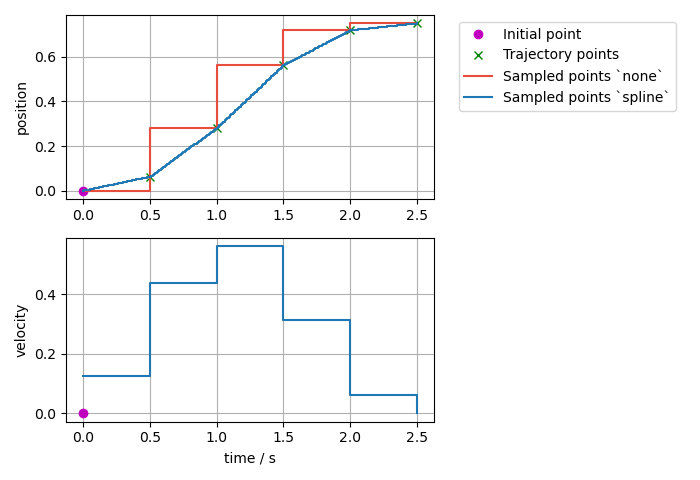
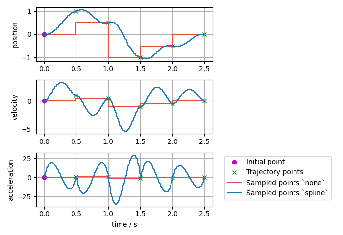

:github_url: https://github.com/ros-controls/ros2_controllers/blob/{REPOS_FILE_BRANCH}/joint_trajectory_controller/doc/trajectory.rst

*Parts of this documentation were originally published in the ROS 1 wiki under the* `CC BY 3.0 license <http://creativecommons.org/licenses/by/3.0/>`_. *Citations are given in the respective section, but were adapted for the ROS 2 implementation.* [#f1]_

Trajectory Representation
---------------------------------

Trajectories are represented internally with ``trajectory_msgs/msg/JointTrajectory`` data structure.

Currently, two interpolation methods are implemented: ``none`` and ``spline``.
By default, a spline interpolator is provided, but it's possible to support other representations.

Interpolation Method ``none``
^^^^^^^^^^^^^^^^^^^^^^^^^^^^^^
It returns the initial point until the time for the first trajectory data point is reached. Then, it simply takes the next given datapoint. Additionally, it does not deduce trajectory from derivatives, i.e., one has to provide position and its derivatives as needed.

Interpolation Method ``spline`` [#f1]_
^^^^^^^^^^^^^^^^^^^^^^^^^^^^^^^^^^^^^^^^

The spline interpolator uses the following interpolation strategies depending on the waypoint specification:

* Linear: Only position is specified. Guarantees continuity at the position level. Discouraged because it yields trajectories with discontinuous velocities at the waypoints.

* Cubic: Position and velocity are specified. Guarantees continuity at the velocity level.

* Quintic: Position, velocity and acceleration are specified: Guarantees continuity at the acceleration level.

Trajectories with velocity fields only, velocity and acceleration only, or acceleration fields only can be processed and are accepted, if ``allow_integration_in_goal_trajectories`` is true. Position (and velocity) is then integrated from velocity (or acceleration, respectively) by Heun's method.

Visualized Examples
^^^^^^^^^^^^^^^^^^^^^^^^^^^^^^^^
To visualize the difference of the different interpolation methods and their inputs, different trajectories defined at a 0.5s grid and are sampled at a rate of 10ms.

Sampled trajectory with linear spline if position is given only

Sampled trajectory with cubic splines if velocity is given only (no deduction for interpolation method ``none``)

.. image:: spline_velocity.png
  :alt: Sampled trajectory with splines if velocity is given only

Sampled trajectory with quintic splines if acceleration is given only (no deduction for interpolation method ``none``)

.. image:: spline_acceleration.png
  :alt: Sampled trajectory with splines if acceleration is given only

Sampled trajectory if position, velocity, and acceleration points are given. If the same integration method was used (``Trajectory`` class uses Heun's method), then the ``spline`` method this gives identical results as above where acceleration only was given as input.

.. image:: spline_position_velocity_acceleration.png
  :alt: Sampled trajectory with splines if position, velocity, and acceleration is given

Sampled trajectory if position, velocity, and acceleration points are given with a nonzero initial point.

.. image:: spline_position_velocity_acceleration_initialpoint.png
  :alt: Sampled trajectory with splines if position, velocity, and acceleration is given with nonzero initial point

Sampled trajectory with splines if inconsistent position, velocity, and acceleration points are given. Interpolation method ``none`` only gives the next input points, while the ``spline`` interpolation method shows high overshoot to match the given trajectory points.

.. rubric:: Footnote

.. [#f1] Adolfo Rodriguez: `joint_trajectory_controller <http://wiki.ros.org/joint_trajectory_controller>`_
