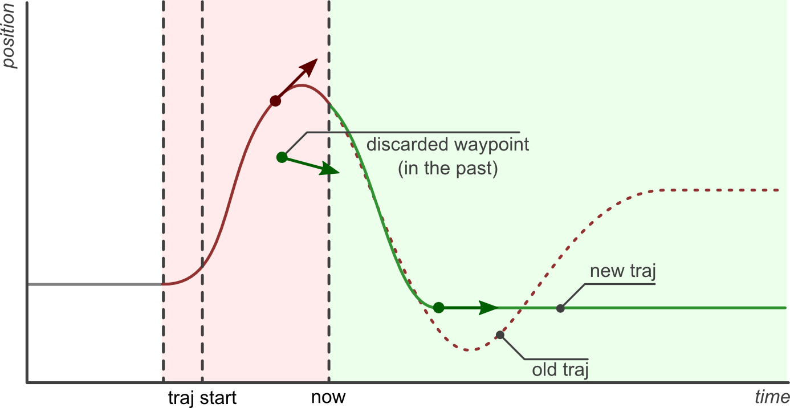

.. _joint_trajectory_controller_userdoc:

joint_trajectory_controller
===========================

Controller for executing joint-space trajectories on a group of joints.
Trajectories are specified as a set of waypoints to be reached at specific time instants,
which the controller attempts to execute as well as the mechanism allows.
Waypoints consist of positions, and optionally velocities and accelerations.

*Parts of this documentation were originally published in the ROS 1 wiki under the* `CC BY 3.0 license <http://creativecommons.org/licenses/by/3.0/>`_. *Citations are given in the respective section, but were adapted for the ROS 2 implementation.* [#f1]_ [#f2]_

Trajectory representation [#f1]_
---------------------------------

The controller is templated to work with multiple trajectory representations.
By default, a spline interpolator is provided, but it's possible to support other representations.
The spline interpolator uses the following interpolation strategies depending on the waypoint specification:

    Linear: Only position is specified. Guarantees continuity at the position level. Discouraged because it yields trajectories with discontinuous velocities at the waypoints.

    Cubic: Position and velocity are specified. Guarantees continuity at the velocity level.

    Quintic: Position, velocity and acceleration are specified: Guarantees continuity at the acceleration level.

Hardware interface type [#f1]_
-------------------------------

The controller is templated to work with multiple hardware interface types.
Currently joints with position, velocity and effort interfaces are supported.
For position-controlled joints, desired positions are simply forwarded to the joints;
while for velocity (effort) joints, the position+velocity trajectory following error is mapped to velocity (effort) commands through a PID loop.
Example controller configurations can be found :ref:`below <ROS 2 interface>`.

Similarly to the trajectory representation case above, it's possible to support new hardware interfaces, or alternative mappings to an already supported interface (eg. a proxy controller for generating effort commands).

Other features
--------------

    Realtime-safe implementation.

    Proper handling of wrapping (continuous) joints.

    Robust to system clock changes: Discontinuous system clock changes do not cause discontinuities in the execution of already queued trajectory segments.

ros2_control interfaces
------------------------

References
^^^^^^^^^^^
(the controller is not yet implemented as chainable controller)

States
^^^^^^^
The state interfaces are defined with ``joints`` and ``state_interfaces`` parameters as follows: ``<joint>/<state_interface>``.
Supported state interfaces are ``position``, ``velocity``, ``acceleration`` and ``effort`` as defined in the `hardware_interface/hardware_interface_type_values.hpp <https://github.com/ros-controls/ros2_control/blob/master/hardware_interface/include/hardware_interface/types/hardware_interface_type_values.hpp>`_.
Legal combinations of state interfaces are:

- ``position``
- ``position`` and ``velocity``
- ``position``, ``velocity`` and ``acceleration``
- ``effort``

Commands
^^^^^^^^^

Using Joint Trajectory Controller(s)
------------------------------------

The controller expects at least position feedback from the hardware.
Joint velocities and accelerations are optional.
Currently the controller does not internally integrate velocity from acceleration and position from velocity.
Therefore if the hardware provides only acceleration or velocity states they have to be integrated in the hardware-interface implementation of velocity and position to use these controllers.

The generic version of Joint Trajectory controller is implemented in this package.
A yaml file for using it could be:

   .. code-block:: yaml

      controller_manager:
        ros__parameters:
          joint_trajectory_controller:
          type: "joint_trajectory_controller/JointTrajectoryController"

      joint_trajectory_controller:
        ros__parameters:
          joints:
            - joint1
            - joint2
            - joint3
            - joint4
            - joint5
            - joint6

          command_interfaces:
            - position

          state_interfaces:
            - position
            - velocity

          action_monitor_rate: 20.0

          allow_partial_joints_goal: false
          open_loop_control: true
          constraints:
            stopped_velocity_tolerance: 0.01
            goal_time: 0.0
            joint1:
              trajectory: 0.05
              goal: 0.03

.. _ROS 2 interface:

ROS 2 interface of the controller [#f1]_
^^^^^^^^^^^^^^^^^^^^^^^^^^^^^^^^^^^^^^^^^
There are two mechanisms for sending trajectories to the controller:

~/follow_joint_trajectory (action server) [control_msgs::action::FollowJointTrajectory]
  Action server for commanding the controller.

~/joint_trajectory (input topic) [trajectory_msgs::msg::JointTrajectory]
  Topic for commanding the controller.

Both use the ``trajectory_msgs/JointTrajectory`` message to specify trajectories, and require specifying values for all the controller joints (as opposed to only a subset) if ``allow_partial_joints_goal`` is not set to ``True``.

The primary way to send trajectories is through the action interface, and should be favored when execution monitoring is desired.
Action goals allow to specify not only the trajectory to execute, but also (optionally) path and goal tolerances.
When no tolerances are specified, the defaults given in the parameter interface are used (see :ref:`parameters`).
If tolerances are violated during trajectory execution, the action goal is aborted, the client is notified, and the current position is held.

The topic interface is a fire-and-forget alternative. Use this interface if you don't care about execution monitoring.
The controller's path and goal tolerance specification is not used in this case, as there is no mechanism to notify the sender about tolerance violations.
Note that although some degree of monitoring is available through the ``~/query_state`` service and ``~/state`` topic it is much more cumbersome to realize than with the action interface.

Further interfaces are:

~/state (output topic) [control_msgs::msg::JointTrajectoryControllerState]
  Topic publishing internal states with the update-rate of the controller manager.

~/query_state (service) [control_msgs::srv::QueryTrajectoryState]
  Query controller state at any future time.

Preemption policy [#f1]_
^^^^^^^^^^^^^^^^^^^^^^^^^^^^^^^^

Only one action goal can be active at any moment, or none if the topic interface is used. Path and goal tolerances are checked only for the trajectory segments of the active goal.

When an active action goal is preempted by another command coming from the action interface, the goal is canceled and the client is notified.

Sending an empty trajectory message from the topic interface (not the action interface) will override the current action goal and not abort the action.

Trajectory replacement [#f2]_
^^^^^^^^^^^^^^^^^^^^^^^^^^^^^^^^

Joint trajectory messages allow to specify the time at which a new trajectory should start executing by means of the header timestamp, where zero time (the default) means "start now".

The arrival of a new trajectory command does not necessarily mean that the controller will completely discard the currently running trajectory and substitute it with the new one.
Rather, the controller will take the useful parts of both and combine them appropriately, yielding a smarter trajectory replacement strategy.

The steps followed by the controller for trajectory replacement are as follows:

  + Get useful parts of the new trajectory: Preserve all waypoints whose time to be reached is in the future, and discard those with times in the past.
    If there are no useful parts (ie. all waypoints are in the past) the new trajectory is rejected and the current one continues execution without changes.

  + Get useful parts of the current trajectory: Preserve the current trajectory up to the start time of the new trajectory, discard the later parts.

  + Combine the useful parts of the current and new trajectories.

The following examples describe this behavior in detail.

The first example shows a joint which is in hold position mode (flat grey line labeled *pos hold* in the figure below).
A new trajectory (shown in red) arrives at the current time (now), which contains three waypoints and a start time in the future (*traj start*).
The time at which waypoints should be reached (``time_from_start`` member of ``trajectory_msgs/JointTrajectoryPoint``) is relative to the trajectory start time.

The controller splices the current hold trajectory at time *traj start* and appends the three waypoints.
Notice that between now and *traj start* the previous position hold is still maintained, as the new trajectory is not supposed to start yet.
After the last waypoint is reached, its position is held until new commands arrive.

.. image:: new_trajectory.png
  :alt: Receiving a new trajectory.

|

The controller guarantees that the transition between the current and new trajectories will be smooth. Longer times to reach the first waypoint mean slower transitions.

The next examples discuss the effect of sending the same trajectory to the controller with different start times.
The scenario is that of a controller executing the trajectory from the previous example (shown in red),
and receiving a new command (shown in green) with a trajectory start time set to either zero (start now),
a future time, or a time in the past.

.. image:: trajectory_replacement_future.png
  :alt: Trajectory start time in the future.

|

.. image:: trajectory_replacement_now.png
  :alt: Zero trajectory start time (start now).

|

Of special interest is the last example, where the new trajectory start time and first waypoint are in the past (before now).
In this case, the first waypoint is discarded and only the second one is realized.

|

.. _parameters:

Details about parameters
^^^^^^^^^^^^^^^^^^^^^^^^

joints (list(string))
  Joint names to control and listen to.

command_joints (list(string))
  Joint names to control. This parameters is used if JTC is used in a controller chain where command and state interfaces don't have same names.

command_interface (list(string))
  Command interfaces provided by the hardware interface for all joints.

  Values: [position | velocity | acceleration] (multiple allowed)

state_interfaces (list(string))
  State interfaces provided by the hardware for all joints.

  Values: position (mandatory) [velocity, [acceleration]].
  Acceleration interface can only be used in combination with position and velocity.

action_monitor_rate (double)
  Rate to monitor status changes when the controller is executing action (control_msgs::action::FollowJointTrajectory).

  Default: 20.0

allow_partial_joints_goal (boolean)
  Allow joint goals defining trajectory for only some joints.

  Default: false

allow_integration_in_goal_trajectories (boolean)
  Allow integration in goal trajectories to accept goals without position or velocity specified

  Default: false

interpolation_method (string)
  The type of interpolation to use, if any. Can be "splines" or "none".

  Default: splines

open_loop_control (boolean)
  Use controller in open-loop control mode:
    + The controller ignores the states provided by hardware interface but using last commands as states for starting the trajectory interpolation.
    + It deactivates the feedback control, see the ``gains`` structure.

  This is useful if hardware states are not following commands, i.e., an offset between those (typical for hydraulic manipulators).

  .. Note::
     If this flag is set, the controller tries to read the values from the command interfaces on activation.
     If they have real numeric values, those will be used instead of state interfaces.
     Therefore it is important set command interfaces to NaN (i.e., ``std::numeric_limits<double>::quiet_NaN()``) or state values when the hardware is started.

  Default: false

constraints (structure)
  Default values for tolerances if no explicit values are states in JointTrajectory message.

constraints.stopped_velocity_tolerance (double)
  Default value for end velocity deviation.

  Default: 0.01

constraints.goal_time (double)
  Maximally allowed tolerance for not reaching the end of the trajectory in a predefined time.

  Default: 0.0 (not checked)

constraints.<joint_name>.trajectory (double)
  Maximally allowed deviation from the target trajectory for a given joint.

  Default: 0.0 (tolerance is not enforced)

constraints.<joint_name>.goal (double)
  Maximally allowed deviation from the goal (end of the trajectory) for a given joint.

  Default: 0.0 (tolerance is not enforced)

gains (structure)
  Only relevant, if ``open_loop_control`` is not set.

  If ``velocity`` is the only command interface for all joints or an ``effort`` command interface is configured, PID controllers are used for every joint.
  This structure contains the controller gains for every joint with the control law

  .. math::

     u = k_{ff} v_d + k_p e + k_i \sum e dt + k_d (v_d - v)

  with the desired velocity :math:`v_d`, the measured velocity :math:`v`, the position error :math:`e` (definition see below),
  the controller period :math:`dt`, and the ``velocity`` or ``effort`` manipulated variable (control variable) :math:`u`, respectively.

gains.<joint_name>.p (double)
  Proportional gain :math:`k_p` for PID

  Default: 0.0

gains.<joint_name>.i (double)
  Integral gain :math:`k_i` for PID

  Default: 0.0

gains.<joint_name>.d (double)
  Derivative gain :math:`k_d` for PID

  Default: 0.0

gains.<joint_name>.i_clamp (double)
  Integral clamp. Symmetrical in both positive and negative direction.

  Default: 0.0

gains.<joint_name>.ff_velocity_scale (double)
  Feed-forward scaling :math:`k_{ff}` of velocity

  Default: 0.0

gains.<joint_name>.normalize_error (bool)
  If true, the position error :math:`e = normalize(s_d - s)` is normalized between :math:`-\pi, \pi`.
  Otherwise  :math:`e = s_d - s` is used, with the desired position :math:`s_d` and the measured
  position :math:`s` from the state interface. Use this for revolute joints without end stop,
  where the shortest rotation to the target position is the desired motion.

  Default: false

Specialized versions of JointTrajectoryController (TBD in ...)
--------------------------------------------------------------

The controller types are placed into namespaces according to their command types for the hardware (see `general introduction into controllers <../../index.rst>`_).

The following version of the Joint Trajectory Controller are available mapping the following interfaces:

  - position_controllers::JointTrajectoryController
    - Input: position, [velocity, [acceleration]]
    - Output: position
  - position_velocity_controllers::JointTrajectoryController
    - Input: position, [velocity, [acceleration]]
    - Output: position and velocity
  - position_velocity_acceleration_controllers::JointTrajectoryController
    - Input: position, [velocity, [acceleration]]
    - Output: position, velocity and acceleration

..   - velocity_controllers::JointTrajectoryController
..     - Input: position, [velocity, [acceleration]]
..     - Output: velocity
.. TODO(anyone): would it be possible to output velocity and acceleration?
..               (to have an vel_acc_controllers)
..   - effort_controllers::JointTrajectoryController
..     - Input: position, [velocity, [acceleration]]
..     - Output: effort

(*Not implemented yet*) When using pure ``velocity`` or ``effort`` controllers a command is generated using the desired state and state error using a velocity feedforward term plus a corrective PID term. (#171)

.. rubric:: Footnote

.. [#f1] Adolfo Rodriguez: `joint_trajectory_controller <http://wiki.ros.org/joint_trajectory_controller>`_
.. [#f2] Adolfo Rodriguez: `Understanding trajectory replacement <http://wiki.ros.org/joint_trajectory_controller/UnderstandingTrajectoryReplacement>`_
