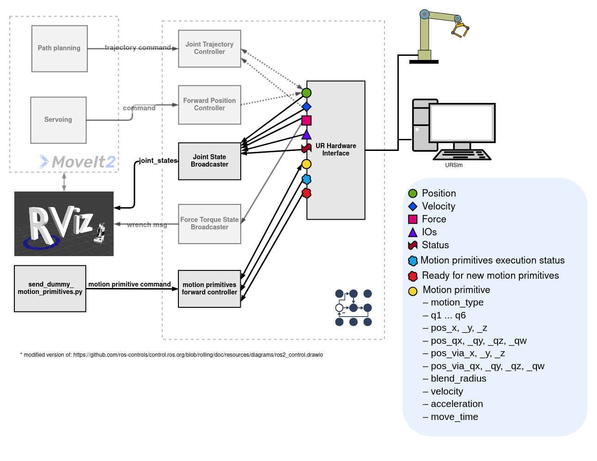

motion_primitive_controllers
==========================================

Package to control robots using motion primitives like LINEAR_JOINT (PTP/ MOVEJ), LINEAR_CARTESIAN (LIN/ MOVEL) and CIRCULAR_CARTESIAN (CIRC/ MOVEC)

# Description
This project provides an interface for sending motion primitives to an industrial robot controller using the `ExecuteMotionPrimitiveSequence.action` action from [control_msgs](https://github.com/ros-controls/control_msgs/blob/motion_primitives/control_msgs/action/ExecuteMotionPrimitiveSequence.action). The controller receives the primitives via the action interface and forwards them through command interfaces to the robot-specific hardware interface. Currently, hardware interfaces for [Universal Robots](https://github.com/UniversalRobots/Universal_Robots_ROS2_Driver) and [KUKA Robots](https://github.com/b-robotized-forks/kuka_experimental/tree/motion_primitive_kuka_driver) are implemented.

- Supported motion primitives:
  - `LINEAR_JOINT`
  - `LINEAR_CARTESIAN`
  - `CIRCULAR_CARTESIAN`

If multiple motion primitives are passed to the controller via the action, the controller forwards them to the hardware interface as a sequence. To do this, it first sends `MOTION_SEQUENCE_START`, followed by each individual primitive, and finally `MOTION_SEQUENCE_END`. All primitives between these two markers will be executed as a single, continuous sequence. This allows seamless transitions (blending) between primitives.

The action interface also allows stopping the current execution of motion primitives. When a stop request is received, the controller sends `STOP_MOTION` to the hardware interface, which then halts the robot's movement. Once the controller receives confirmation that the robot has stopped, it sends `RESET_STOP` to the hardware interface. After that, new commands can be sent.

This can be done, for example, via a Python script as demonstrated in the [`example python script`](https://github.com/UniversalRobots/Universal_Robots_ROS2_Driver/blob/main/ur_robot_driver/examples/send_dummy_motion_primitives_ur10e.py) in the `Universal_Robots_ROS2_Driver` package.

## Command and State Interfaces
To transmit the motion primitives, the following command and state interfaces are required:

### Command Interfaces
These interfaces are used to send motion primitive data to the hardware interface:
- `motion_type`: Type of motion primitive (LINEAR_JOINT, LINEAR_CARTESIAN, CIRCULAR_CARTESIAN)
- `q1` – `q6`: Target joint positions for joint-based motion
- `pos_x`, `pos_y`, `pos_z`: Target Cartesian position
- `pos_qx`, `pos_qy`, `pos_qz`, `pos_qw`: Orientation quaternion of the target pose
- `pos_via_x`, `pos_via_y`, `pos_via_z`: Intermediate via-point position for circular motion
- `pos_via_qx`, `pos_via_qy`, `pos_via_qz`, `pos_via_qw`: Orientation quaternion of via-point
- `blend_radius`: Blending radius for smooth transitions
- `velocity`: Desired motion velocity
- `acceleration`: Desired motion acceleration
- `move_time`: Optional duration for time-based execution (For LINEAR_JOINT and LINEAR_CARTESIAN. If move_time > 0, velocity and acceleration are ignored)

### State Interfaces
These interfaces are used to communicate the internal status of the hardware interface back to the `motion_primitives_forward_controller`.
- `execution_status`: Indicates the current execution state of the primitive. Possible values are:
  - `IDLE`: No motion in progress
  - `EXECUTING`: Currently executing a primitive
  - `SUCCESS`: Last command finished successfully
  - `ERROR`: An error occurred during execution
  - `STOPPING`: The hardware interface has received the `STOP_MOTION` command, but the robot has not yet come to a stop.
  - `STOPPED`: The robot was stopped using the `STOP_MOTION` command and must be reset with the `RESET_STOP` command before executing new commands.
- `ready_for_new_primitive`: Boolean flag indicating whether the interface is ready to receive a new motion primitive

 ## Parameters
 This controller uses the [`generate_parameter_library`](https://github.com/PickNikRobotics/generate_parameter_library) to handle its parameters. The parameter [definition file located in the src folder](https://github.com/ros-controls/ros2_controllers/blob/master/motion_primitives_forward_controller/src/motion_primitives_forward_controller.yaml) contains descriptions for all the parameters used by the controller.
 An example parameter file for this controller can be found in [the test directory](https://github.com/ros-controls/ros2_controllers/blob/master/motion_primitives_forward_controller/test/motion_primitives_forward_controller_params.yaml).

# Architecture Overview
Architecture for a UR robot with [`Universal_Robots_ROS2_Driver` in motion primitives mode](https://github.com/UniversalRobots/Universal_Robots_ROS2_Driver).

Architecture for a KUKA robot with [`kuka_eki_motion_primitives_hw_interface`](https://github.com/b-robotized-forks/kuka_experimental/tree/motion_primitive_kuka_driver/kuka_eki_motion_primitives_hw_interface).

# Demo-Video with UR10e

# Demo-Video with KR3

