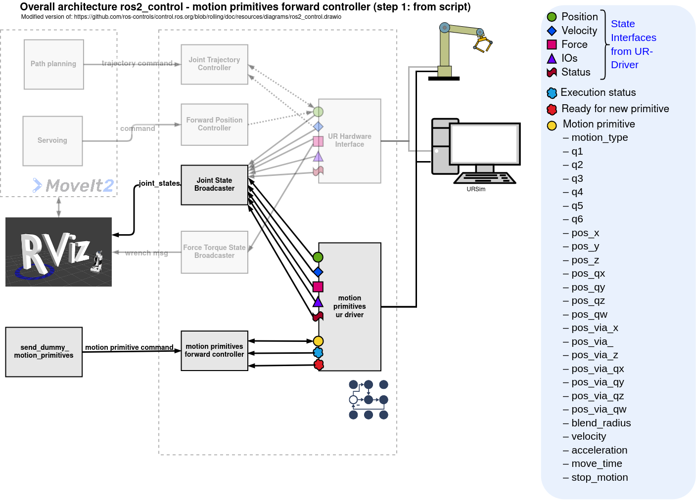

motion_primitives_forward_controller
==========================================

Package to control robots using motion primitives like LINEAR_JOINT (PTP/ MOVEJ), LINEAR_CARTESIAN (LIN/ MOVEL) and CIRCULAR_CARTESIAN (CIRC/ MOVEC)

This project provides an interface for sending motion primitives to an industrial robot controller using the `MotionPrimitive.msg` message type from the [industrial_robot_motion_interfaces](https://github.com/StoglRobotics-forks/industrial_robot_motion_interfaces/tree/helper-types) package. A custom fork of this package is used, which includes additional helper types to enhance motion command flexibility and sequencing.

## Features

- Support for basic motion primitives:
  - `LINEAR_JOINT`
  - `LINEAR_CARTESIAN`
  - `CIRCULAR_CARTESIAN`
- Additional helper types:
  - `STOP_MOTION`: Immediately stops the current robot motion and clears all pending primitives in the controller's queue.
  - `MOTION_SEQUENCE_START` / `MOTION_SEQUENCE_END`: Define a motion sequence block. All primitives between these two markers will be executed as a single, continuous sequence. This allows seamless transitions (blending) between primitives.

## Architecture Overview
The following diagram shows the architecture for a UR robot.
For this setup, the [`motion_primitive_ur_driver`](https://github.com/StoglRobotics-forks/Universal_Robots_ROS2_Driver_MotionPrimitive) is used.

1. **Command Reception**  
   Motion primitives can be published to the `~/reference` topic. These messages are received by the `reference_callback()` method in the controller.  
   This can be done, for example, via a Python script as demonstrated in the [`motion_primitive_ur_driver`](https://github.com/StoglRobotics-forks/Universal_Robots_ROS2_Driver_MotionPrimitive/blob/main/ur_robot_driver/examples/send_dummy_motion_primitives.py) package.

2. **Command Handling Logic**  
   - If the received primitive is of type `STOP_MOTION`, it is directly forwarded to the hardware interface through the command interface, and all queued primitives in the controller are discarded.
   - If the primitive is of any other type, it is appended to the internal motion primitive queue. The maximum queue size is configurable via a YAML configuration file.

3. **Motion Execution Flow**  
   The `update()` method in the controller:
   - Reads the current `execution_state` from the hardware interface via the state interface and publishes it to the `~/state` topic.
   - Reads the `ready_for_new_primitive` state flag. If `true`, the next primitive from the queue is sent to the hardware interface for execution.

4. **Sequencing Logic**  
   Sequencing logic for grouped execution (between `MOTION_SEQUENCE_START` and `MOTION_SEQUENCE_END`) is handled within the hardware interface layer. The controller itself only manages queueing and forwarding logic.

# Related packages/ repos
- [industrial_robot_motion_interfaces (with additional helper types for stop and motion sequence)](https://github.com/StoglRobotics-forks/industrial_robot_motion_interfaces/tree/helper-types)
- [ros2_controllers with motion_primitives_forward_controller](https://github.com/StoglRobotics-forks/ros2_controllers/tree/motion_primitive_forward_controller/motion_primitives_forward_controller)
- [Universal_Robots_ROS2_Driver with motion_primitive_ur_driver](https://github.com/StoglRobotics-forks/Universal_Robots_ROS2_Driver_MotionPrimitive)
- [Universal_Robots_Client_Library with movec from urfeex](https://github.com/urfeex/Universal_Robots_Client_Library/tree/movec_movep)