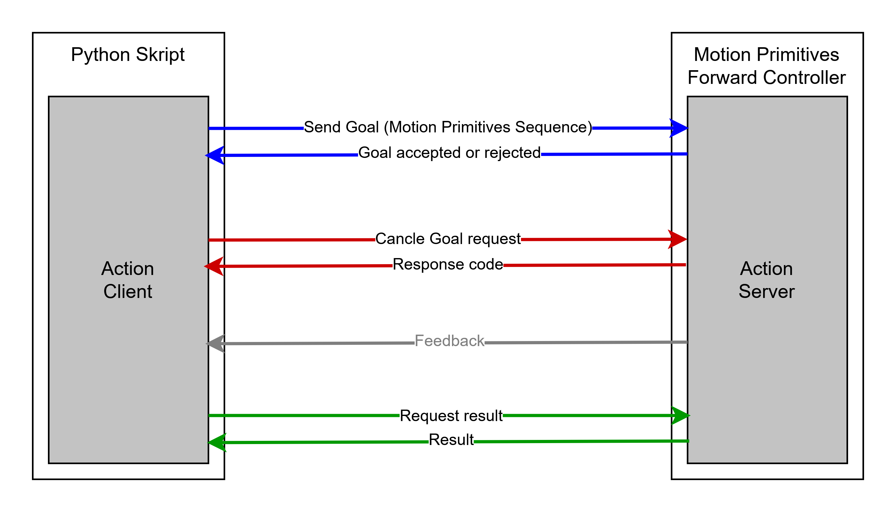
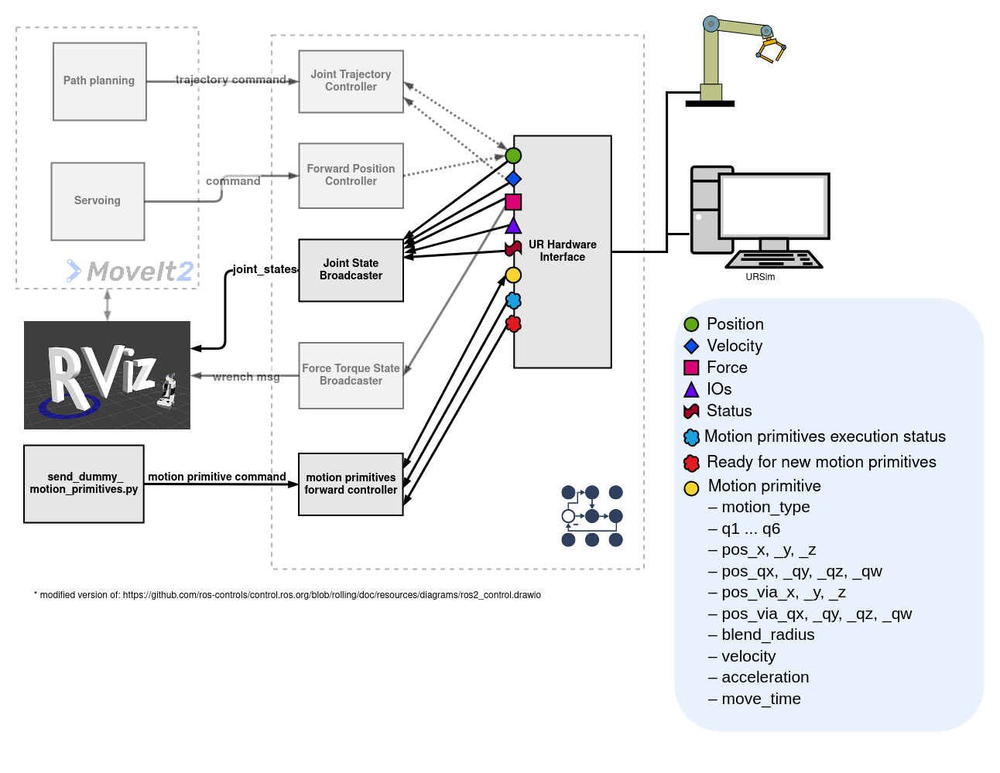
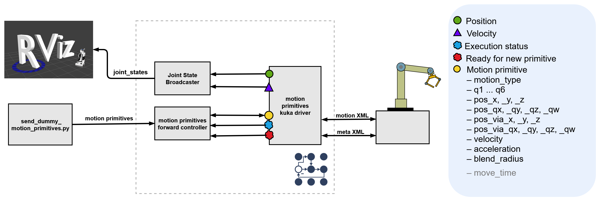
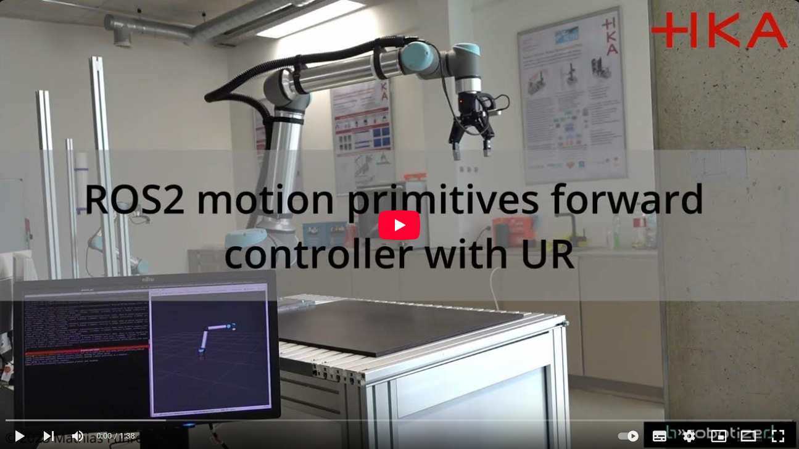
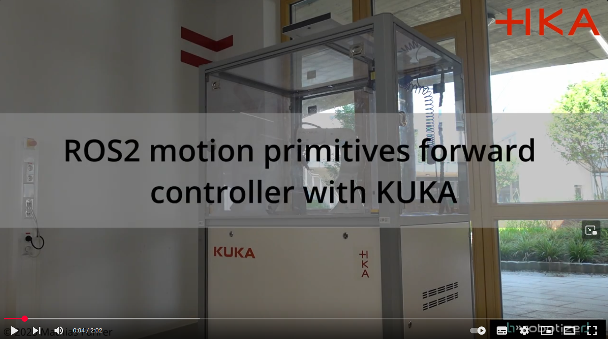
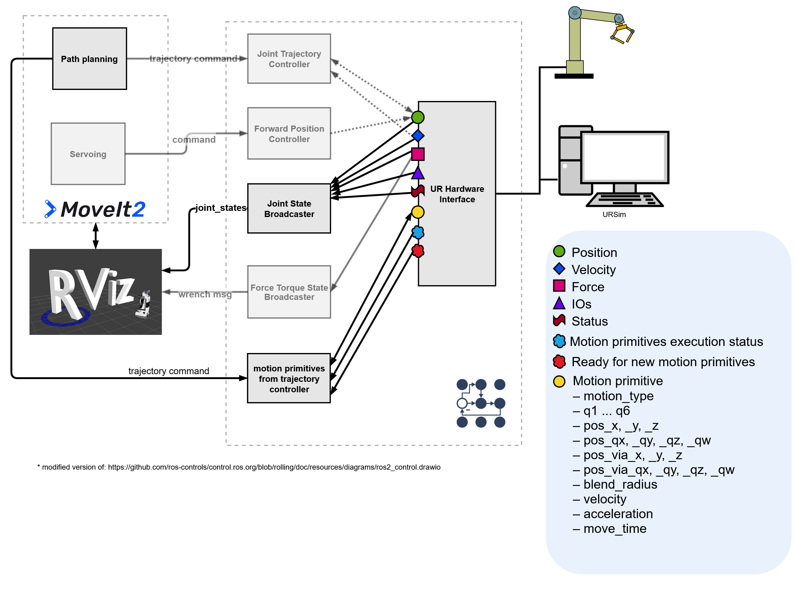
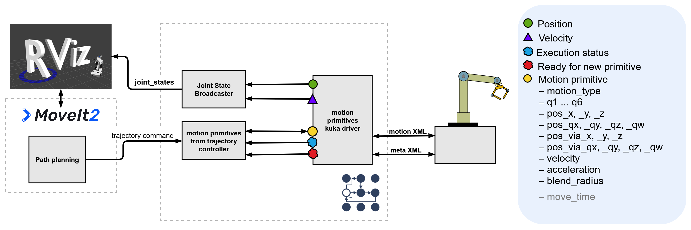
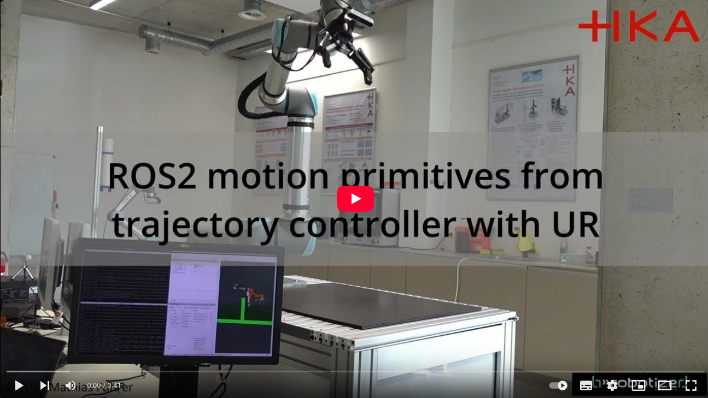
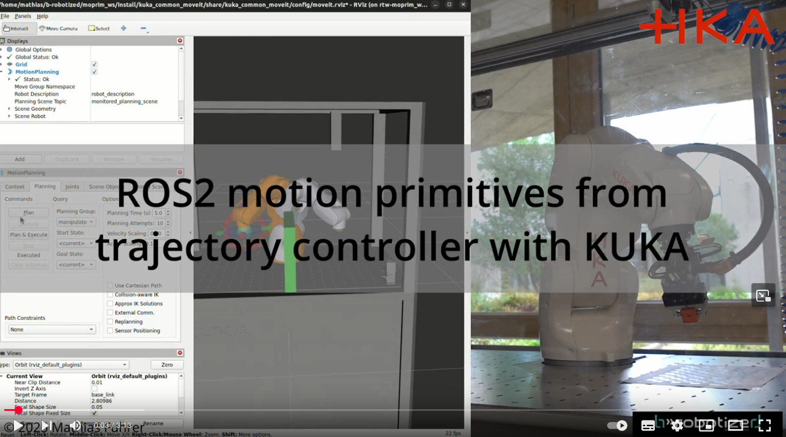

motion_primitive_controllers
==========================================

Package to control robots using motion primitives like LINEAR_JOINT (PTP/ MOVEJ), LINEAR_CARTESIAN (LIN/ MOVEL) and CIRCULAR_CARTESIAN (CIRC/ MOVEC)

**This package contains two controllers:**
1. [motion_primitives_forward_controller](#moprim_forward_controller)
2. [motion_primitives_from_trajectory_controller](#moprim_from_traj_controller)

<a name="moprim_forward_controller"/>

# motion_primitives_forward_controller
This controller provides an interface for sending motion primitives to an industrial robot controller using the `ExecuteMotionPrimitiveSequence.action` action from [control_msgs](https://github.com/ros-controls/control_msgs/blob/motion_primitives/control_msgs/action/ExecuteMotionPrimitiveSequence.action). The controller receives the primitives via the action interface and forwards them through command interfaces to the robot-specific hardware interface. Currently, hardware interfaces for [Universal Robots](https://github.com/UniversalRobots/Universal_Robots_ROS2_Driver) and [KUKA Robots](https://github.com/b-robotized-forks/kuka_experimental/tree/motion_primitive_kuka_driver) are implemented.

- Supported motion primitives:
  - `LINEAR_JOINT`
  - `LINEAR_CARTESIAN`
  - `CIRCULAR_CARTESIAN`

If multiple motion primitives are passed to the controller via the action, the controller forwards them to the hardware interface as a sequence. To do this, it first sends `MOTION_SEQUENCE_START`, followed by each individual primitive, and finally `MOTION_SEQUENCE_END`. All primitives between these two markers will be executed as a single, continuous sequence. This allows seamless transitions (blending) between primitives.

The action interface also allows stopping the current execution of motion primitives. When a stop request is received, the controller sends `STOP_MOTION` to the hardware interface, which then halts the robot's movement. Once the controller receives confirmation that the robot has stopped, it sends `RESET_STOP` to the hardware interface. After that, new commands can be sent.

This can be done, for example, via a Python script as demonstrated in the [`example python script`](https://github.com/UniversalRobots/Universal_Robots_ROS2_Driver/blob/main/ur_robot_driver/examples/send_dummy_motion_primitives_ur10e.py) in the `Universal_Robots_ROS2_Driver` package.

## Architecture Overview
Architecture for a UR robot with [`Universal_Robots_ROS2_Driver` in motion primitives mode](https://github.com/UniversalRobots/Universal_Robots_ROS2_Driver).

Architecture for a KUKA robot with [`kuka_eki_motion_primitives_hw_interface`](https://github.com/b-robotized-forks/kuka_experimental/tree/motion_primitive_kuka_driver/kuka_eki_motion_primitives_hw_interface).

## Demo-Video with UR10e

## Demo-Video with KR3

<a name="moprim_from_traj_controller"/>

# motion_primitives_from_trajectory_controller

### motion_primitives_from_trajectory_controller

The `motion_primitives_from_trajectory_controller` builds on the same architecture as the `motion_primitives_forward_controller` and uses the same command and state interfaces, making it compatible with the same hardware interfaces. However, instead of receiving motion primitives directly, it takes a `FollowJointTrajectory` action as input and approximates the trajectory using either `PTP` (`LINEAR_JOINT`) or `LIN` (`LINEAR_CARTESIAN`) motion primitives.

The approximation mode can be selected via the `approximate_mode` parameter, with options `"RDP_PTP"` or `"RDP_LIN"`, using the Ramer-Douglas-Peucker algorithm to reduce the trajectory points. Tolerances for the approximation are defined by:
- `epsilon_joint_angle` for PTP (in radians)
- `epsilon_cart_position` (in meters) and `epsilon_cart_angle` (in radians) for LIN

The `use_time_not_vel_and_acc` parameter determines whether motion duration is calculated based on time stamps or if velocity and acceleration values are used instead. For PTP primitives, joint velocity and acceleration are taken as the maximum values from the original trajectory. For LIN primitives, Cartesian velocity and acceleration are estimated numerically from the end-effector path.

A blending radius is also calculated automatically, based on the distance to neighboring target points, and clamped between 0.01 m and 0.1 m.

Alternatively, users can override velocity, acceleration, and blend radius values with the following parameters:
- PTP: `joint_vel_overwrite`, `joint_acc_overwrite`
- LIN: `cart_vel_overwrite`, `cart_acc_overwrite`
- Blend radius: `blend_radius_overwrite`

This controller enables executing collision-free trajectories planned with MoveIt using approximated motion primitives.

## Architecture Overview
Architecture for a UR robot with [`Universal_Robots_ROS2_Driver` in motion primitives mode](https://github.com/UniversalRobots/Universal_Robots_ROS2_Driver).

Architecture for a KUKA robot with [`kuka_eki_motion_primitives_hw_interface`](https://github.com/b-robotized-forks/kuka_experimental/tree/motion_primitive_kuka_driver/kuka_eki_motion_primitives_hw_interface).

## Demo-Video with UR10e

## Demo-Video with KR3

# TODOs/ improvements
- Use references for command and state interfaces to improve code readability and less error-prone.
- Extend the tests
   - Test for a sequence of multiple primitives
   - Test for canceling movement
