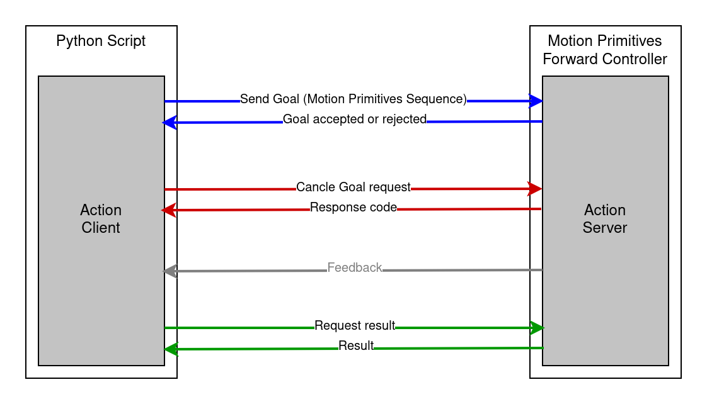

motion_primitives_forward_controller
==========================================

Package to control robots using motion primitives like LINEAR_JOINT (PTP/ MOVEJ), LINEAR_CARTESIAN (LIN/ MOVEL) and CIRCULAR_CARTESIAN (CIRC/ MOVEC)

This project provides an interface for sending motion primitives to an industrial robot controller using the `ExecuteMotion.action` action from the [industrial_robot_motion_interfaces](https://github.com/UniversalRobots/industrial_robot_motion_interfaces) package. The controller receives the primitives via the action interface and forwards them through command interfaces to the robot-specific hardware interface. Currently, hardware interfaces for [Universal Robots](https://github.com/UniversalRobots/Universal_Robots_ROS2_Driver) and [KUKA Robots](https://github.com/b-robotized-forks/kuka_experimental/tree/motion_primitive_kuka_driver) are implemented.

- Supported motion primitives:
  - `LINEAR_JOINT`
  - `LINEAR_CARTESIAN`
  - `CIRCULAR_CARTESIAN`

If multiple motion primitives are passed to the controller via the action, the controller forwards them to the hardware interface as a sequence. To do this, it first sends `MOTION_SEQUENCE_START`, followed by each individual primitive, and finally `MOTION_SEQUENCE_END`. All primitives between these two markers will be executed as a single, continuous sequence. This allows seamless transitions (blending) between primitives.

The action interface also allows stopping the current execution of motion primitives. When a stop request is received, the controller sends `STOP_MOTION` to the hardware interface, which then halts the robot's movement. Once the controller receives confirmation that the robot has stopped, it sends `RESET_STOP` to the hardware interface. After that, new commands can be sent.

This can be done, for example, via a Python script as demonstrated in the [`example python script`](https://github.com/UniversalRobots/Universal_Robots_ROS2_Driver/blob/main/ur_robot_driver/examples/send_dummy_motion_primitives_hka_ur10e.py) in the `Universal_Robots_ROS2_Driver` package.

## Architecture Overview
The following diagram shows the architecture for a UR robot.
For this setup, the [motion primitives mode of the `Universal_Robots_ROS2_Driver`](https://github.com/UniversalRobots/Universal_Robots_ROS2_Driver) is used.

# TODOs/ improvements
- Use references for command and state interfaces to improve code readability and less error-prone.
- Extend the tests
   - Test for a sequence of multiple primitives
   - Test for canceling movement
