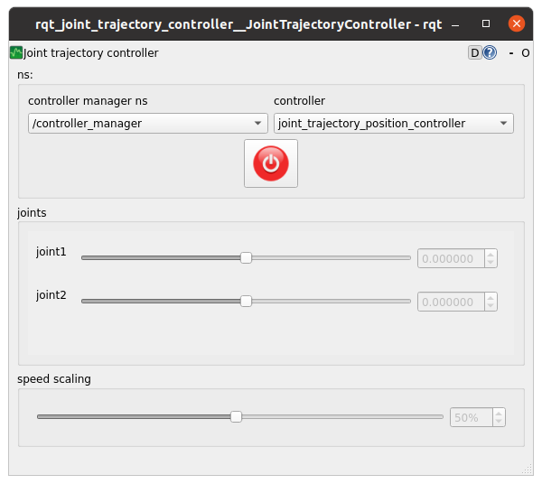

:github_url: https://github.com/ros-controls/ros2_controllers/blob/{REPOS_FILE_BRANCH}/rqt_joint_trajectory_controller/doc/userdoc.rst

.. _rqt_joint_trajectory_controller_userdoc:

rqt_joint_trajectory_controller
===============================

The rqt_joint_trajectory_controller provides an intuitive graphical way to test different joint positions and trajectories without having to manually construct complex trajectory messages or use command line interfaces.

The interface allows you to:

* Select the controller manager namespace and controller from dropdown menus.
* Adjust target positions for joints (joint1 and joint2) using interactive sliders.
* Fine-tune joint positions with precise numerical inputs.
* Control the motion speed using the speed scaling slider.
* Activate the trajectory execution with the central power button.
* Visualize current joint configurations in real-time.

Trajectory / publish settings
-----------------------------

Enabling (arming) a controller with the power button does **not** send commands automatically.
This avoids the erratic joint movement that occurs when a trajectory with a fixed ``time_from_start`` is republished at a high rate (see `#1579 <https://github.com/ros-controls/ros2_controllers/issues/1579>`_).

Instead, sending is explicit and configurable:

* **Send Once**: publishes a single trajectory with the current joint targets. Available whenever the controller is armed.
* **continuous send**: when checked, republishes the command at ``pub freq`` (Hz). Off by default.
* **start time (ms)**: overrides the trajectory ``time_from_start``. Set to ``0`` to auto-compute the duration from the joint velocity limits and the speed scaling.
* **pub freq (Hz)**: rate at which commands are republished while ``continuous send`` is active.

