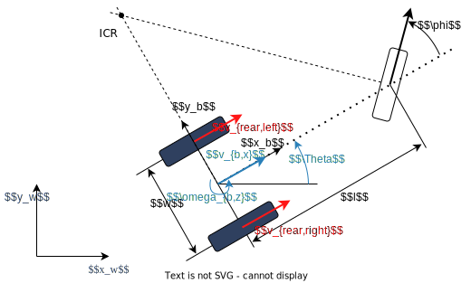
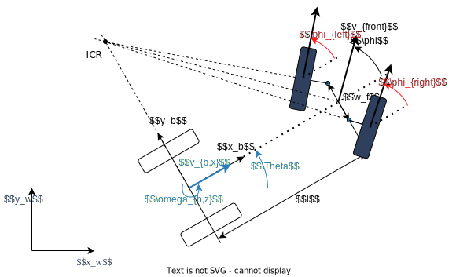

:github_url: https://github.com/ros-controls/ros2_controllers/blob/{REPOS_FILE_BRANCH}/steering_controllers_library/doc/userdoc.rst

.. _steering_controllers_library_userdoc:

steering_controllers_library
=============================

.. _steering_controller_status_msg: https://github.com/ros-controls/control_msgs/blob/master/control_msgs/msg/SteeringControllerStatus.msg
.. _odometry_msg: https://github.com/ros2/common_interfaces/blob/{DISTRO}/nav_msgs/msg/Odometry.msg
.. _twist_msg: https://github.com/ros2/common_interfaces/blob/{DISTRO}/geometry_msgs/msg/TwistStamped.msg
.. _tf_msg: https://github.com/ros2/geometry2/blob/{DISTRO}/tf2_msgs/msg/TFMessage.msg

Library with shared functionalities for mobile robot controllers with steering drives, with so-called non-holonomic constraints.

The library implements generic odometry and update methods and defines the main interfaces.

The update methods only use inverse kinematics, it does not implement any feedback control loops like path-tracking controllers etc.

Car-Like robots basics and nomenclature
--------------------------------------------------------------

This section introduces different car-like robot kinematics. The nomenclature is based on `Siciliano et.al - Robotics: Modelling, Planning and Control <https://link.springer.com/book/10.1007/978-1-84628-642-1>`__.

.. note::

  The forward integration of the kinematic model using the encoders of the wheel actuators — is referred to as **odometric localization** or **passive localization** or **dead reckoning**. We will call it just **odometry**.

Unicycle Model
,,,,,,,,,,,,,,,,

To define the coordinate systems, consider the following simple unicycle model

.. image:: images/unicycle.svg
   :width: 550
   :align: center
   :alt: Unicycle

* :math:`x_b,y_b` is the body-frame coordinate system of the robot, located in the contact point of the wheel on the ground.
* :math:`x_w,y_w` is the world coordinate system.
* :math:`x,y` are the cartesian coordinates of the robot in world coordinates.
* :math:`\Theta` is the heading angle of the robot, i.e. the orientation of the robot's :math:`x_b`-axis w.r.t. the world's :math:`x_w`-axis.

In the following, we want to command the robot with a desired body twist

.. math::

  \vec{\nu}_b = \left[ \begin{array}{l}
                      \vec{\omega}_{b} \\
                      \vec{v}_{b} \\
                      \end{array}\right],

where :math:`\vec{v}_{b}` is the linear velocity of the robot in its body-frame, and :math:`\omega_{b,z}` is the angular velocity of the robot in its body-frame. As we consider steering robots on a flat surface, it is sufficient to give

* :math:`v_{b,x}`, i.e. the linear velocity of the robot in :math:`x_b`-axis direction.
* :math:`\omega_{b,z}`, i.e. the angular velocity of the robot around :math:`x_z`-axis.

as desired system inputs. We will formulate the inverse kinematics to calculated desired commands to the robot from the given body twist.

Bicycle Model
,,,,,,,,,,,,,,,,

The following picture shows a car-like robot with two wheels, where the front wheel is steerable. This model is also known as the bicycle model.

* :math:`\phi` is the steering angle of the front wheel
* :math:`v_{rear}, v_{front}` is the velocity of the rear and front wheel
* :math:`l` is the wheelbase

We assume that the wheels are rolling without slipping. This means that the velocity of the contact point of the wheel with the ground is zero and the wheel's velocity points in the direction perpendicular to the wheel's axis. The **Instantaneous Center of Rotation** (ICR), i.e. the center of the circle around which the robot rotates, is located at the intersection of the lines that are perpendicular to the wheels' axes and go through the contact points of the wheels with the ground.

As a consequence of the no-slip condition, the velocity of the two wheels have to fulfill the following constraint:

.. math::
  v_{rear} = v_{front} \cos(\phi)

**Forward Kinematics**

The forward kinematics of the car-like model can be calculated with

.. math::
  \dot{x} &= v_{b,x} \cos(\Theta) \\
  \dot{y} &= v_{b,x} \sin(\Theta) \\
  \dot{\Theta} &= \frac{v_{b,x}}{l} \tan(\phi)

**Inverse Kinematics**

The steering angle is one command input of the robot:

.. math::
  \phi = \arctan\left(\frac{l w_{b,z}}{v_{b,x}} \right)

For the rear wheel drive, the velocity of the rear wheel is the second input of the robot:

.. math::
  v_{rear} = v_{b,x}

For the front wheel drive, the velocity of the front wheel is the second input of the robot:

.. math::
  v_{front} = \frac{v_{b,x}}{\cos(\phi)}

**Odometry**

We have to distinguish between two cases: Encoders on the rear or on the front wheel.

For the rear wheel case:

.. math::
  \dot{x} &= v_{rear} \cos(\Theta) \\
  \dot{y} &= v_{rear} \sin(\Theta) \\
  \dot{\Theta} &= \frac{v_{rear}}{l} \tan(\phi)

For the front wheel case:

.. math::
  \dot{x} &= v_{front} \cos(\Theta) \cos(\phi)\\
  \dot{y} &= v_{front} \sin(\Theta) \cos(\phi)\\
  \dot{\Theta} &= \frac{v_{front}}{l} \sin(\phi)

Double Traction Axis
,,,,,,,,,,,,,,,,,,,,,

The following picture shows a car-like robot with three wheels, where there are two traction wheels at the rear.

* :math:`w_r` is the wheel track of the rear axle.

**Forward Kinematics**

The forward kinematics is the same as the car-like model above.

**Inverse Kinematics**

The turning radius of the robot is

.. math::
  R_b = \frac{l}{\tan(\phi)}

Then the rear wheels' velocity have to fulfil these conditions to avoid slipping

.. math::
  v_{rear,left} &= v_{b,x}\frac{R_b - w_r/2}{R_b}\\
  v_{rear,right} &= v_{b,x}\frac{R_b + w_r/2}{R_b}

**Odometry**

The calculation of :math:`v_{b,x}` from two encoder measurements of the traction axle is overdetermined.
If there is no slip and the encoders are ideal,

.. math::
   v_{b,x} = v_{rear,left} \frac{R_b}{R_b - w_r/2} =  v_{rear,right} \frac{R_b}{R_b + w_r/2}

holds. But to get a more robust solution, we take the average of both , i.e.,

.. math::
   v_{b,x} = 0.5 \left(v_{rear,left} \frac{R_b}{R_b - w_r/2} + v_{rear,right} \frac{R_b}{R_b + w_r/2}\right).

Ackermann steering
,,,,,,,,,,,,,,,,,,,,,

The following picture shows a car-like robot with four wheels, where there are two independent steering wheels in the front.

* :math:`w_f` is the wheel track of the front axle, measured between the two kingpins.

To avoid slipping of the front wheels, the steering angle of the front wheels cannot be equal.
This is the so-called **Ackermann steering**.

.. note::
  The Ackermann steering can also be performed by a `mechanical linkage between the two front wheels <https://en.wikipedia.org/wiki/Ackermann_steering_geometry>`__.  In this case the robot has only one steering input, and the steering angle of the two front wheels is mechanically coupled. Then the inverse kinematics of the robot is the same as the car-like model above.

**Forward Kinematics**

The forward kinematics is the same as the car-like model above.

**Inverse Kinematics**

The turning radius of the robot is

.. math::
  R_b = \frac{l}{\tan(\phi)}

Then the front wheels' steering angles have to fulfil these conditions to avoid slipping

.. math::
  \phi_{left} &= \arctan\left(\frac{l}{R_b - w_f/2}\right) &= \arctan\left(\frac{2l\sin(\phi)}{2l\cos(\phi) - w_f\sin(\phi)}\right)\\
  \phi_{right} &= \arctan\left(\frac{l}{R_b + w_f/2}\right) &= \arctan\left(\frac{2l\sin(\phi)}{2l\cos(\phi) + w_f\sin(\phi)}\right)

**Odometry**

The calculation of :math:`\phi` from two angle measurements of the steering axle is overdetermined.
If there is no slip and the measurements are ideal,

.. math::
    \phi = \arctan\left(\frac{l + w_f/2 \tan(\phi_{left})}{\tan(\phi_{left})}\right) = \arctan\left(\frac{l - w_f/2 \tan(\phi_{right})}{\tan(\phi_{right})}\right)

holds. But to get a more robust solution, we take the average of both , i.e.,

.. math::
    \phi = 0.5 \left(\arctan\left(\frac{l + w_f/2 \tan(\phi_{left})}{\tan(\phi_{left})}\right) + \arctan\left(\frac{l - w_f/2 \tan(\phi_{right})}{\tan(\phi_{right})}\right)\right).

Ackermann steering with traction
,,,,,,,,,,,,,,,,,,,,,,,,,,,,,,,,,

The following picture shows a car-like robot with four wheels, where there are two independent steering wheels in the front which are also independently driven.

* :math:`d_{kp}` is the distance from the kingpin to the contact point of the front wheel with the ground.

**Forward Kinematics**

The forward kinematics is the same as the car-like model above.

**Inverse Kinematics**

To avoid slipping of the front wheels, the velocity of the front wheels cannot be equal and

.. math::
  \frac{v_{front,left}}{R_{left}} = \frac{v_{front,right}}{R_{right}} = \frac{v_{b,x}}{R_b}

with turning radius of the robot and the left/right front wheel

.. math::
  R_b       &= \frac{l}{\tan(\phi)} \\
  R_{left}  &= \frac{l-d_{kp}\sin(\phi_{left})}{\sin(\phi_{left})}\\
  R_{right} &= \frac{l+d_{kp}\sin(\phi_{right})}{\sin(\phi_{right})}.

This gives the following inverse kinematics equations

.. math::
  v_{front,left} &= \frac{v_{b,x}(l-d_{kp}\sin(\phi_{left}))}{R_b\sin(\phi_{left})}\\
  v_{front,right} &= \frac{v_{b,x}(l+d_{kp}\sin(\phi_{right}))}{R_b\sin(\phi_{right})}

with the steering angles of the front wheels from the Ackermann steering equations above.

**Odometry**

The calculation of :math:`v_{b,x}` from two encoder measurements of the traction axle is again overdetermined.
If there is no slip and the encoders are ideal,

.. math::
   v_{b,x} = v_{front,left} \frac{R_b\sin(\phi_{left})}{l-d_{kp}\sin(\phi_{left})} =  v_{front,right} \frac{R_b\sin(\phi_{right})}{l+d_{kp}\sin(\phi_{right})}

holds. But to get a more robust solution, we take the average of both , i.e.,

.. math::
   v_{b,x} = 0.5 \left( v_{front,left} \frac{R_b\sin(\phi_{left})}{l-d_{kp}\sin(\phi_{left})} +  v_{front,right} \frac{R_b\sin(\phi_{right})}{l+d_{kp}\sin(\phi_{right})}\right).

Execution logic of the controller
----------------------------------

The controller uses velocity input, i.e., stamped `twist messages <twist_msg_>`_ where linear ``x`` and angular ``z`` components are used.
Values in other components are ignored.

In the chain mode the controller provides two reference interfaces, one for linear velocity and one for steering angle position.
Other relevant features are:

* support for front and rear steering configurations;
* odometry publishing as Odometry and TF message;
* input command timeout based on a parameter.

The command for the wheels are calculated using ``odometry`` library where based on concrete kinematics traction and steering commands are calculated.

Currently implemented kinematics
--------------------------------------------------------------

* :ref:`Bicycle <bicycle_steering_controller_userdoc>` - with one steering and one drive joints;
* :ref:`Tricylce <tricycle_steering_controller_userdoc>` - with one steering and two drive joints;
* :ref:`Ackermann <ackermann_steering_controller_userdoc>` - with two steering and two drive joints.

.. toctree::
  :hidden:

   Bicycle <../../bicycle_steering_controller/doc/userdoc.rst>
   Tricylce <../../tricycle_steering_controller/doc/userdoc.rst>
   Ackermann <../../ackermann_steering_controller/doc/userdoc.rst>

Description of controller's interfaces
--------------------------------------

References (from a preceding controller)
,,,,,,,,,,,,,,,,,,,,,,,,,,,,,,,,,,,,,,,,,

Used when controller is in chained mode (``in_chained_mode == true``).

- ``<controller_name>/linear/velocity``      double, in m/s
- ``<controller_name>/angular/position``     double, in rad

Command interfaces
,,,,,,,,,,,,,,,,,,,

If parameter ``front_steering == true``

- ``<front_wheels_names[i]>/position``     double, in rad
- ``<rear_wheels_names[i]>/velocity``      double, in m/s

If parameter ``front_steering == false``

- ``<front_wheels_names[i]>/velocity``     double, in m/s
- ``<rear_wheels_names[i]>/position``      double, in rad

State interfaces
,,,,,,,,,,,,,,,,,

Depending on the ``position_feedback``, different feedback types are expected

* ``position_feedback == true`` --> ``TRACTION_FEEDBACK_TYPE = position``
* ``position_feedback == false`` --> ``TRACTION_FEEDBACK_TYPE = velocity``

If parameter ``front_steering == true``

- ``<front_wheels_names[i]>/position``                  double, in rad
- ``<rear_wheels_names[i]>/<TRACTION_FEEDBACK_TYPE>``   double, in m or m/s

If parameter ``front_steering == false``

- ``<front_wheels_names[i]>/<TRACTION_FEEDBACK_TYPE>``  double, in m or m/s
- ``<rear_wheels_names[i]>/position``                   double, in rad

Subscribers
,,,,,,,,,,,,

Used when controller is not in chained mode (``in_chained_mode == false``).

- ``<controller_name>/reference``  [`geometry_msgs/msg/TwistStamped <twist_msg_>`_]

Publishers
,,,,,,,,,,,

- ``<controller_name>/odometry``          [`nav_msgs/msg/Odometry <odometry_msg_>`_]
- ``<controller_name>/tf_odometry``       [`tf2_msgs/msg/TFMessage <tf_msg_>`_]
- ``<controller_name>/controller_state``  [`control_msgs/msg/SteeringControllerStatus <steering_controller_status_msg_>`_]

Parameters
,,,,,,,,,,,

This controller uses the `generate_parameter_library <https://github.com/PickNikRobotics/generate_parameter_library>`_ to handle its parameters.

For an exemplary parameterization see the ``test`` folder of the controller's package.

.. generate_parameter_library_details:: ../src/steering_controllers_library.yaml
